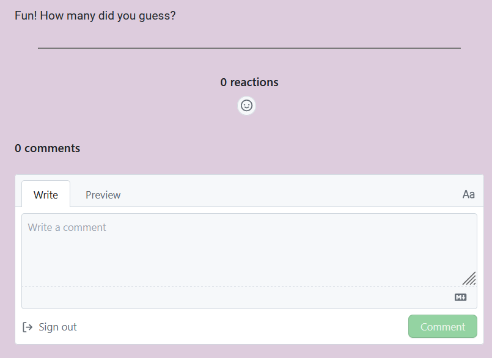

# alifeee's blog

This repo contains blog stuff that I write, as well as any code used to generate it. It can be found on [`blog.alifeee.co.uk`](https://blog.alifeee.co.uk)

## Markdown

Markdown parsing is done client side using [zero-md](https://github.com/zerodevx/zero-md). This is to avoid using a build step.

```html
<head>
    ...
  <script
    type="module"
    src="https://cdn.jsdelivr.net/gh/zerodevx/zero-md@2/dist/zero-md.min.js"
  ></script>
  ...
</head>
<body>
  ...
  <zero-md src="/example.md"></zero-md>
  ...
</body>
```

## Comments

[giscus](https://giscus.app) is used for comments.



## Email Subscription

<https://www.tinyletter.com/> is used for email subscriptions.

Newsletter: <https://tinyletter.com/alifeee>

App: <https://app.tinyletter.com/>

## RSS Feed

An RSS feed is generated using [Python](./utilities.py/rss_feed.py) via [workflow](./.github/workflows/rss.yml). You can find (and subscribe to it) here: <https://blog.alifeee.co.uk/feed.xml>.
