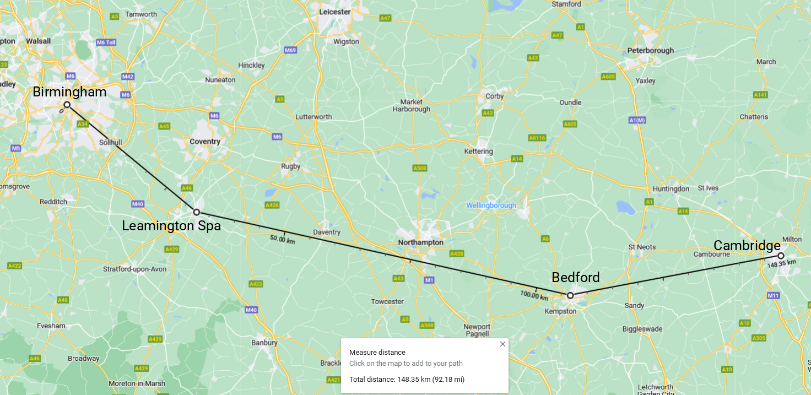
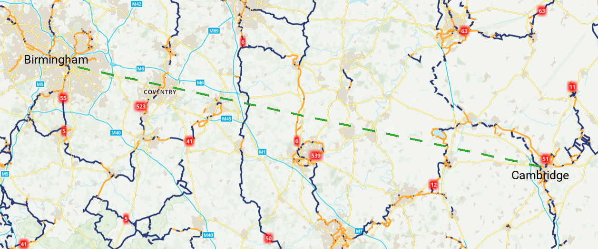
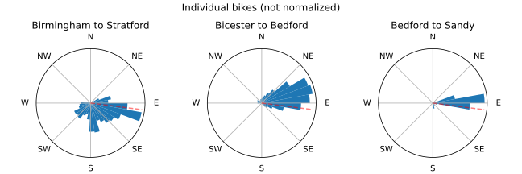

# I biked from Birmingham to Cambridge (a tribute to National Cycle Routes)

1. [Technicalities - how far *did* I bike?](#technicalities---how-far-did-i-bike)

1. [How to plan a bike route](#how-to-plan-a-bike-route)

    1. [Google Maps hates bikes](#google-maps-hates-bikes)

1. [National Cycle Routes!](#national-cycle-routes)

    1. [Why get lost when you can not get lost](#why-get-lost-when-you-can-not-get-lost)

    1. [Do they go the right way?](#do-they-go-the-right-way)

    1. [Why go the right way when you can go the wrong way](#why-go-the-right-way-when-you-can-go-the-wrong-way)

    1. [How to fix the problem of going the wrong way](#how-to-fix-the-problem-of-going-the-wrong-way)

1. [And what?](#and-what)

1. [Appendix: Tools](#appendix-tools)

Recently, I biked from Birmingham to Cambridge.

More accurately, I half-biked, half-trained from Birmingham to Cambridge.
If it sounds more impressive, I "biked the distance from Birmingham to Cambridge".

<figcaption>

Look ma! I did most of it with my own legs!
[Source](https://github.com/alifeee/blog/blob/main/bike-to-cambridge/src/route.ipynb).

</figcaption>

## Technicalities - how far *did* I bike?

<figcaption>

If I were a crow, it would be a nice life.
I would also get to Cambridge in 148 km, with stopovers.
From [Google Maps](https://maps.google.com/)

</figcaption>

## How to plan a bike route

### Google Maps hates bikes

<figcaption>

Spot the difference.
From [gpx.studio](https://gpx.studio/).

</figcaption>

<figcaption>

Which of these would *you* rather bike on?
[Source](https://github.com/alifeee/blog/blob/main/bike-to-cambridge/src/maps_vs_cycleroutes.ipynb).

</figcaption>

## National Cycle Routes!

<figcaption>Ramp down to the Stratford canal, National Cycle Route 5.</figcaption>

### Why get lost when you can not get lost

<figcaption>

Whoosh!
Picture from a bridge next to the ford.
Would've been fun to try and get through on a bike though.

</figcaption>

<figcaption>

Get to the end of this, but a thousand times, and you might end up in Cambridge.

</figcaption>

### Do they go the right way?

<figcaption>

Here's a game. Why does everything go the wrong way?
Sorry, that wasn't a game.
From [OS Maps](https://explore.osmaps.com/).

</figcaption>

### Why go the right way when you can go the wrong way

<figcaption>

Turns out the fastest way to get somewhere is to go that way.
[Source](https://github.com/alifeee/blog/blob/bike-to-cambridge/bike-to-cambridge/src/directionality.ipynb).

</figcaption>

<figcaption>

Going the right way is for nerds.
[Source](https://github.com/alifeee/blog/blob/bike-to-cambridge/bike-to-cambridge/src/directionality.ipynb).

</figcaption>

### How to fix the problem of going the wrong way

<figcaption>

I'm big. My bike is big.
Sometimes we fit in a train.

</figcaption>

<figcaption>

An insight into my definitely organised mind:
what I sketched to see which trains I could use on my journey if I needed to.
Blue is the bike route, with green the trains that could be used as shortcuts.
Background from [National Rail](https://www.nationalrail.co.uk/stations_destinations/rail-maps.aspx) ([PDF](./data/Rail%20map%20v37%20orange%20Dec%2022.pdf)).

</figcaption>

## And what?

<figcaption>

My bike in front of [millennium milepost 897X](https://www.sustrans.org.uk/national-cycle-network/millennium-mileposts).
6 km into day 2, the 80 km day.

</figcaption>

## Appendix: Tools
