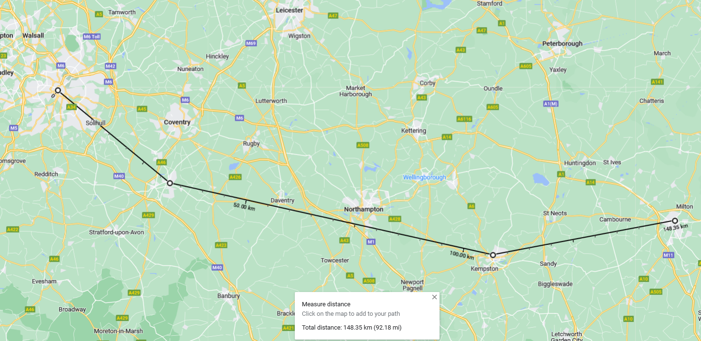
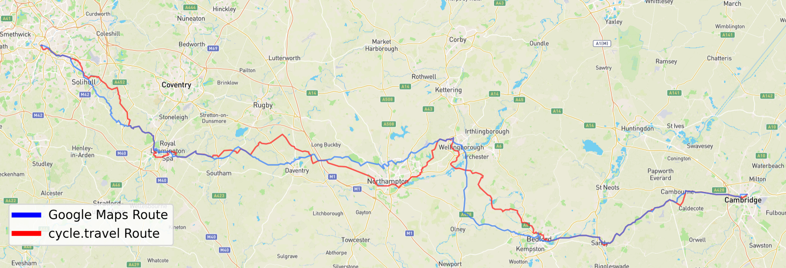

# I biked from Birmingham to Cambridge (a tribute to National Cycle Routes)

1. [Technicalities - how far *did* I bike?](#technicalities---how-far-did-i-bike)

1. [How to plan a bike route](#how-to-plan-a-bike-route)

    1. [Google Maps hates bikes](#google-maps-hates-bikes)

    1. [National Cycle Routes - I love Sustrans](#national-cycle-routes---i-love-sustrans)

        1. [Why get lost when you can not get lost](#why-get-lost-when-you-can-not-get-lost)

        1. [Why go the right way when you can go the wrong way](#why-go-the-right-way-when-you-can-go-the-wrong-way)

        1. [How to fix the problem of going the wrong way](#how-to-fix-the-problem-of-going-the-wrong-way)

1. [And what?](#and-what)

1. [Appendix: Tools](#appendix-tools)

Recently, I biked from Birmingham to Cambridge.

More accurately, I half-biked, half-trained from Birmingham to Cambridge.
If it sounds more impressive, I "biked the distance from Birmingham to Cambridge".

<figcaption>
Look ma! I did most of it with my own legs!
</figcaption>

## Technicalities - how far *did* I bike?

<figcaption>
If I were a crow, it would be a nice life. I would also get to Cambridge in 148 km, with stopovers.
</figcaption>

## How to plan a bike route

### Google Maps hates bikes

<figcaption>
Spot the difference.
</figcaption>

### National Cycle Routes - I love Sustrans

#### Why get lost when you can not get lost

#### Why go the right way when you can go the wrong way

#### How to fix the problem of going the wrong way

## And what?

## Appendix: Tools

<figcaption>

My bike in front of [millennium milepost 897X](https://www.sustrans.org.uk/national-cycle-network/millennium-mileposts).
4 miles into a 50-mile day...

</figcaption>

<figcaption>Ramp down to the Stratford canal, National Cycle Route 5.</figcaption>

