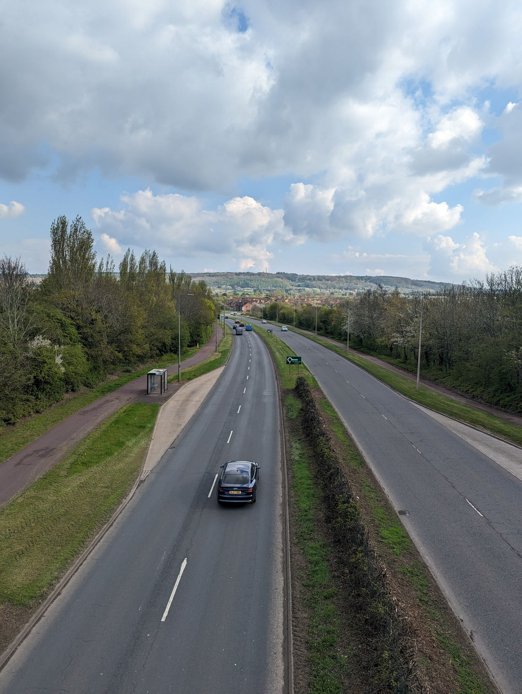

# I biked from Birmingham to Cambridge (a tribute to National Cycle Routes)

- [The route](#the-route)

  - [A tribute to the National Cycle Network](#a-tribute-to-the-national-cycle-network)

Recently, I biked from Birmingham to Cambridge.

More accurately, I half-biked, half-trained from Birmingham to Cambridge.
If it sounds more impressive, I "biked the distance from Birmingham to Cambridge".

## Technicalities - how far *did* I bike?

## How to plan a bike route

### Google Maps hates bikes

### National Cycle Routes - I love Sustrans

#### Why get lost when you can not get lost

#### Why go the right way when you can go the wrong way

#### How to fix the problem of going the wrong way

## And what?

## Appendix: Tools

<figcaption>

My bike in front of [millennium milepost 897X](https://www.sustrans.org.uk/national-cycle-network/millennium-mileposts).
4 miles into a 50-mile day...

</figcaption>

<figcaption>Ramp down to the Stratford canal, National Cycle Route 5.</figcaption>

