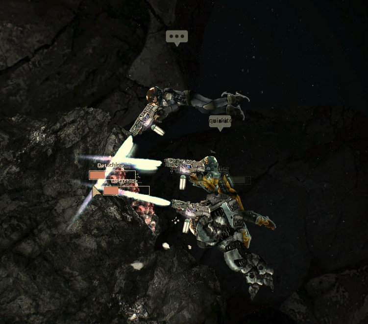
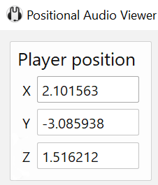
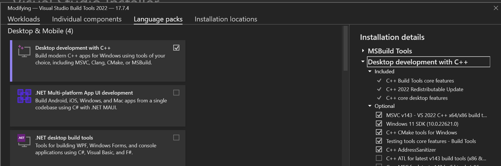
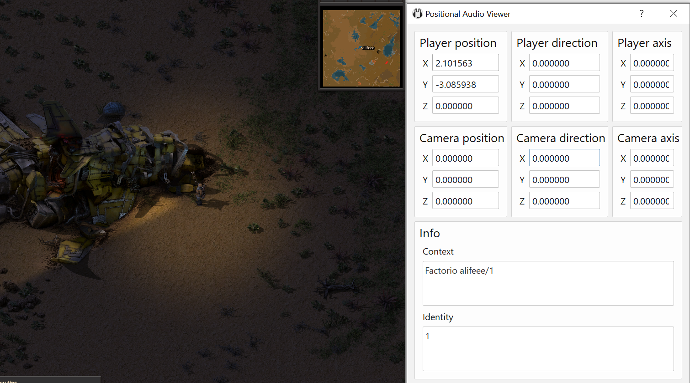
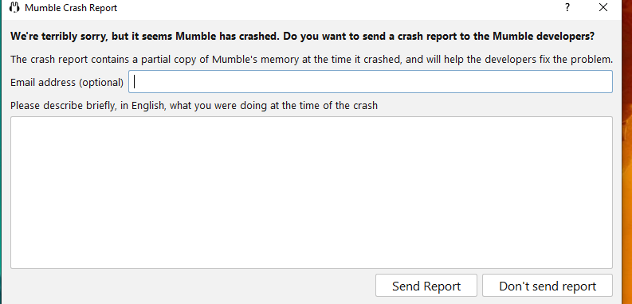
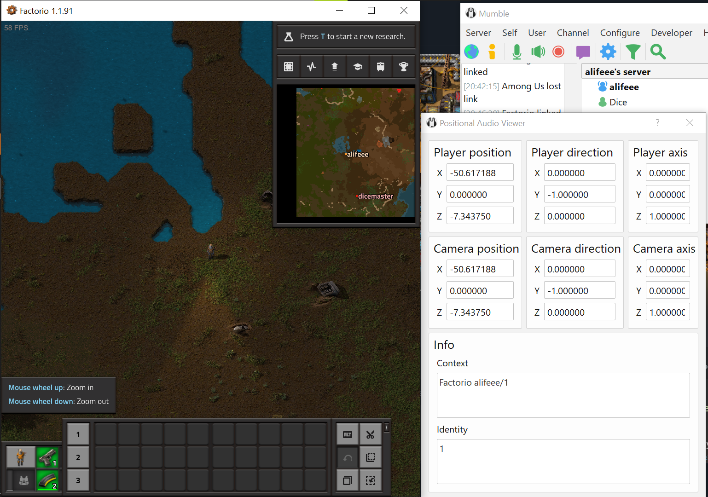
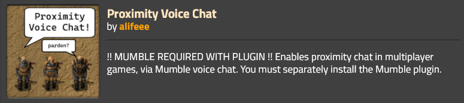

# Coding Projects! #2: Proximity-based voice chat for Factorio

<word-count parent=".markdown-body"></word-count>

Earlier this year, I played [Barotrauma] weekly for 21 weeks with friends. Barotrauma is a "2D co-op submarine simulator – in space, with survival horror and RPG elements", and most importantly for me: it has a proximity voice-chat system. This means that if you are crafting some nuclear fuel rods at the rear of the ship, you will not hear your crewmates being torn apart by eldritch beings that found their way into the front of the ship. You will be on your way past the medbay to fix a leak in the crew quarters, and hear the medical doctors through the door discussing which of the crewmembers to use for their next *'experiment'*. You will be picked as the next dead-man-walking to leave the submarine to mine precious metals, and will make your way across the ship to get orders in-person from the captain.



<figcaption>

Here, three of us make small talk while we mine outside the submarine. What conversations were being had inside the submarine, we were unaware.

</figcaption>

As you can tell, I had a lot of fun playing Barotrauma; it probably deserves a blog post of its own. When we played, we were usually around 8 players, which, had we used Discord for voice chat, would have been chaos trying to hear what everyone was saying. Proximity chat added greatly to our enjoyment of the game, and planted the question in my mind of which other games which could be as fun. In my view, there are a few criteria which made Barotrauma great and that I would like in another game that could be as fun. They are:

- Proximity chat. Games which come to mind immediately which have this are Among Us and Minecraft. There are [lists online][proxchat games].
- Campaign-based. By this, I mean games where you play the same save, and wouldn't start fresh every week. Among Us is out.
- Players are... in proximity to each other. In Barotrauma, you can always hear mutterings and ramblings of other people as you are all trapped inside a submarine. In Minecraft, you may travel massive distances and end up spending most of your time separate from each other.

The games on the [above list][proxchat games] that are probably most like what I'm after are Sea of Thieves and Ark/Rust. However, the secret fourth category is: people I know must own the game. So, after all that, I was suggested [Factorio], which I thought would be a bunch of fun to play with a bunch of people. Factorio doesn't pass the third criterion of "players are always vaguely close to each other", but it's a great game, so I'm sure I can allow it one strike. Since I've not played yet, it remains to be seen how close people remain to each other when playing: maybe people stick together more if they have proximity chat!

There was only one problem with Factorio: it didn't have proximity chat. That, my dear friend, is why we're here. I wanted to play Factorio with proximity chat so much that I made it myself. Within these words lies the tales, struggle, and strife of that process.

1. [Research](#research)
   1. [How do other games do it?](#how-do-other-games-do-it)
   2. [How can I do it for Factorio?](#how-can-i-do-it-for-factorio)
   3. [Using Mumble](#using-mumble)
      1. [Memory hacking?](#memory-hacking)
      2. [Using the Link plugin?](#using-the-link-plugin)
      3. [Using the filesystem?](#using-the-filesystem)
2. [Making the Factorio Mod](#making-the-factorio-mod)
3. [Making the Mumble Plugin](#making-the-mumble-plugin)
   1. [Build the C files](#build-the-c-files)
   2. [Bundle the plugin](#bundle-the-plugin)
   3. [Spit out random data](#spit-out-random-data)
   4. [Only run when `Factorio.exe` is running](#only-run-when-factorioexe-is-running)
   5. [Parse the Factorio log file](#parse-the-factorio-log-file)
   6. [Check the log file exists](#check-the-log-file-exists)
   7. [Check the log file is recent](#check-the-log-file-is-recent)
   8. [Build it on Windows](#build-it-on-windows)
4. [It works! (for a bit)](#it-works-for-a-bit)
5. [It works! (weirdly)](#it-works-weirdly)
6. [It works! (actually)](#it-works-actually)
7. [Conclusion](#conclusion)
8. [People who helped](#people-who-helped)
   1. [Testing it works!](#testing-it-works)
   2. [Reddit thread ⇗](#reddit-thread-)
   3. [Factorio discord ⇗](#factorio-discord-)
   4. [Mumble Matrix ⇗](#mumble-matrix-)
9. [Links](#links)

## Research

### How do other games do it?

The only game I had played with user-created proximity chat before was [Among Us]. I had remembered that we had all downloaded ["BetterCrewLink"](https://github.com/OhMyGuus/BetterCrewLink), which was a desktop app, which connected to a voice server, connected to the game running on your machine, and somehow did proximity chat from that. Looking at the code on GitHub, the program read the memory addresses of things like player position, and also looked like it implemented its own entire [VoIP] system (Voice over IP).

This seemed a lot of work. I didn't fancy creating (or even trying to clone) what is basically Discord or TeamSpeak, so I did some more Googling.

### How can I do it for Factorio?

Googling around, the only mention I could find of Factorio and proximity voice chat was a single [Reddit thread].


Without this thread, I don't think I would have started trying to make a Factorio proximity chat mod. But, with the thread, I had some leads. [Faxxobeat] made me aware that [Mumble] - an open source voice chat client (like Discord or TeamSpeak) - had support for "positional audio" via "plugins". There were already [plugins for many games][Mumble repo#plugins] and lots of documentation on PA (Positional Audio). This sounded like an approachable plan, since this way all I had to do to implement proximity chat in Factorio was make a plugin for Mumble, which would handle the rest of the voice chat. And, reading the [requirements for a Mumble plugin][Mumble PA#data], I just had to write a plugin which gave Mumble the player position, player name and the current game server. It seemed "easy enough".

### Using Mumble

I found a *lot* of different documentation for Mumble and Mumble's PA. There was a [wiki][Mumble wiki#PA], a [website][Mumble website#PA], and [some markdown files][Mumble md#PA]. These were, respectively: outdated with a banner saying as such; outdated with no such information; and up-to-date. Initially, I did not find the third guide (the up to date one), so naturally after seeing the wiki was outdated, I used the second, outdated (unbeknownst to me at the time) guide. This had several pages:

- [Positional Audio (PA) explanation for users](https://www.mumble.info/documentation/user/positional-audio/)
- [Positional Audio (PA) explanation for developers](https://www.mumble.info/documentation/developer/positional-audio/)
  - [Plugin creation explanation](https://www.mumble.info/documentation/developer/positional-audio/create-plugin/)
    - [Plugin creation guide](https://www.mumble.info/documentation/developer/positional-audio/create-plugin/guide/)
    - [List of memory analysis tools](https://www.mumble.info/documentation/developer/positional-audio/create-plugin/memory-analysis-tools/)
  - [Link plugin explanation][Mumble website#link]

That's a lot of docs. The guide above is *very* comprehensive, so I tried to follow it. However, as I said, it was outdated. Having followed links from the wiki which said "the wiki is outdated, please use the website", the potential that the website was outdated was not on my radar, so I ploughed on.

#### Memory hacking?

The plugin guide leads you through creating a plugin which searches a game's memory for memory addresses of the player position and other variables. I attempted this a little with Cheat Engine, but it led nowhere for Factorio. As I could've learnt by reading the [Reddit thread] I already found: Factorio does not use static memory addresses for player data. Thus, I could not use memory hacking to make a plugin.

#### Using the Link plugin?

The next option was the [link plugin][Mumble website#link], which works generically for any game. This is meant to be for the developers of the game to implement themselves (by providing some known-location memory addresses which are updated with player position data, which Mumble can then find), but I also thought that it could be possible to make a mod which does similar (at game startup: write position data to memory and keep it updated when playing).

Factorio provides a modding API, using Lua, making everyone's lives easier when it comes to modding, as you can just write a mod in Lua, and it should stay compatible with small game updates.
This seems much more fun than other ecosystems like Minecraft where [mods][TC#1] become [unplayable][TC#2] because they have to be [updated][TC#3] for [each version][TC#4] of [the game][TC#5] that [releases][TC#6].
Since I wanted whatever I made to be long-lasting, I wanted to use the official modding API. This meant using Lua. Everything that I could do with code was now described by the [Factorio API Docs]. Unfortunately, playing with memory was not on this list, so using the Link plugin was also not possible.

#### Using the filesystem?

My final idea was that I could make a simple Factorio mod in Lua which writes the position of the player to a file, and then I could write a Mumble plugin in C which looks for and reads this file, exposing the data to Mumble's Positional Audio system. This would mean that to use the plugin, you need to install two things: the Factorio mod; and the Mumble plugin, but it also made the connection between Mumble and Factorio minimal, as either the mod or plugin could be easily changed without needing to change the other, since they were only interacting via file write or file read.

At this point, I had popped my head into the Mumble Matrix chat via a [link I found on the website][Mumble website#contact] and chatted with some developers about making the plugin. Thankfully, this is when I found out that I'd been following an outdated guide, and was pointed to the most recent, updated, and clear [markdown documentation][Mumble md#PA].

## Making the Factorio Mod

The brief was clear: make a mod which took the player position, and write it to a file.

I had never modded Factorio or used Lua before, so I read some [Factorio modding tutorial] and [read about Lua][Lua website] too.

Then, I joined the [Factorio discord] to ask how I could go about doing what I wanted. Less than 30 minutes[¹](https://discord.com/channels/139677590393716737/306402592265732098/1153658704835657729) after my initial message, a user, [Xorimuth][Discord#xorimuth], told me that you could write files with Factorio's [write_file][Lua#write_file] function, and provided a code snippet to do what I wanted:

```lua
script.on_nth_tick(30, function()
  for _, player in pairs(game.connected_players) do
    game.write_file("player_position.txt", serpent.dump(player.position), false, player.index)
  end
end)
```

This, basically, was the finished Factorio mod. I made some small changes and re-formatted it and the whole Factorio mod is one script and 12 lines:

```lua
script.on_nth_tick(5, function()
    for index, player in pairs(game.connected_players) do
        local info = "XYZ, Player, sUrface, Server\n" .. 
               "x: " .. player.position.x .. "\n" .. 
               "y: " .. player.position.y .. "\n" .. 
               "z: " .. 0 .. "\n" .. 
               "p: " .. index .. "\n" .. 
               "u: " .. player.surface.index .. "\n" .. 
               "s: " .. game.get_player(1).name .. "\n"
        game.write_file("mumble_positional-audio_information.txt", info, false, player.index)
    end
end)
```

<figcaption>

In Lua, `..` concatenates strings and whitespace is ignored. Fun :).

</figcaption>

Every 1/12 of a second (5 ticks), this outputs something a text file into [Factorio's `script-output` folder][Factorio application directory] that looks like:

```text
XYZ, Player, sUrface, Server
x: -54.8046875
y: 71.08203125
z: 0
p: 1
u: 1
s: alifeee
```

<figcaption>

You may complain at me for `sUrface`, but [I think it's neat](https://youtu.be/DrQqajtiRt4).

</figcaption>

That's it! Now for the Mumble plugin. I'm sure it will definitely be as easy and not take much, *much* longer.

## Making the Mumble Plugin

After finding the up-to-date documentation for-real-this-time, I also found the [Mumble plugin template]. This was a simple implementation of a Mumble plugin, with the latest API, written in C. In theory, it was [possible to use C++ or Rust][Mumble md#language-bindings] to write the plugin, but to keep it simple, I decided to keep to C. I had also found that there was a [Positional Audio Helper][MumblePAHelper], which was only available in the pre-release of Mumble, [version 1.5][Mumble website#1.5], so I installed that (which will come back to bite me, as you will see...). The helper showed all the data involved with positional audio:


<figcaption>

PA uses: `position` (where you are), `direction` (which way you're facing) and `axis` (which way you're leaning, for games with leaning) for the player and the camera; `Context` (usually a server ID) to determine if the players are in the same game-server; and `Identity` (usually player ID) to tell players apart. If your context is the same as another person's, you will hear them based on where they are in the game. Positional audio!

</figcaption>

Now, I had a debug window showing lots of 0s that I needed to put values in, and a well-described plugin API, so I forked the [Mumble plugin template] and started developing.

### Build the C files

First, I had to be able to build the plugin. After screwing around for too long installing [GCC] I decided to just use GitHub Actions to build the C file, as I found an [official template for building multi-platform C and C++ projects][GH Actions cmake template]. This built the plugin for Linux and Windows whenever I pushed to the repository. I also was able to build the plugin with GCC, for Linux, on WSL, but I hadn't managed to install it for Windows yet, and had to wait several minutes for the action to complete if I wanted a Windows version. This worked fine initially, as I mostly was writing and testing C code on Linux, then I would copy it into the main plugin file if I wanted to try it on Windows. Because I was just reading and writing a file initially, it didn't matter whether I was writing on Windows or Linux. At least, not until I wanted to test it at the same time as playing Factorio.

### Bundle the plugin

Next, I wanted to make the plugin installable using the Mumble UI. Following [the bundling guide][Mumble md#bundling], this involved writing a `manifest.xml` file

```xml
<?xml version="1.0" encoding="UTF-8"?>
<bundle version="1.0.0">
  <assets>
    <plugin os="windows" arch="x64">plugin.dll</plugin>
    <plugin os="linux" arch="x64">libplugin.so</plugin>
  </assets>
  <name>Factorio Positional Audio</name>
  <version>1.0.0</version>
</bundle>
```

...and then zipping the built C files and `manifest.xml` file, and renaming the file to end in `.mumble_plugin`. This is well summarised by the [GitHub workflow that does exactly that][code#bundle-mumble]:

```yaml
- name: Bundle
  run: |
    mv build/libfactorio_linux_x86_64.so libplugin.so
    mv build/Release/plugin.dll plugin.dll
    mv mumble/manifest.xml manifest.xml
    zip -MM factorio.mumble_plugin manifest.xml libplugin.so plugin.dll
```

<figcaption>

Every character has a story. Here, the story is that little `-MM`. Without it, `zip` ignored any missing files. I spent a while wondering why my plugin didn't work before realising that `manifest.xml` didn't exist, and `zip` was just happily ignoring that fact.

</figcaption>

### Spit out random data

The function that Mumble calls to get positional data is `mumble_fetchPositionalData`. To check it worked before I carried on, I first output random data to see it in the helper.

```c
bool mumble_fetchPositionalData(float *avatarPos, float *avatarDir, float *avatarAxis, float *cameraPos, float *cameraDir, float *cameraAxis, const char **context, const char **identity)
{
  avatarPos[0] = 0.01f + ((float)rand() / (float)RAND_MAX) * 0.01f;
  avatarPos[1] = 0.01f + ((float)rand() / (float)RAND_MAX) * 0.01f;
  avatarPos[2] = 0.01f + ((float)rand() / (float)RAND_MAX) * 0.01f;

  ...

  return true;
}
```

This worked great!



Now I had remembered how C works, and had a better grasp of the Mumble API, I could start attaching the plugin to Factorio.

### Only run when `Factorio.exe` is running

At this stage, the plugin was always active. The first integration step was to get it to only activate if `Factorio.exe` was running. Mumble occasionally calls `mumble_initPositionalData` for each installed plugin to see if they should begin. In this case, we should begin (return OK) if the game is open.

```c
uint8_t mumble_initPositionalData(const char *const *programNames, const uint64_t *programPIDs, size_t programCount)
{
  // programNames is a list of, e.g., ["Notion.exe", "System", "firefox.exe", "factorio.exe"]
  // loop through programs, if FACTORIO_EXE is found, return MUMBLE_PDEC_OK
  bool found = false;
  for (size_t i = 0; i < programCount; i++)
  {
    if (strcmp(programNames[i], FACTORIO_EXE) == 0)
    {
      found = true;
      break;
    }
  }

  if (!found)
  {
  // If the game is not running, return MUMBLE_PDEC_ERROR_TEMP
  return MUMBLE_PDEC_ERROR_TEMP;
  }

  return MUMBLE_PDEC_OK;
}
```

### Parse the Factorio log file

To get the data from the text file, it has to be parsed. This is done with this code

```c
int parse_factorio_logfile(float *x, float *y, float *z, int *player, int *surface, char **server, size_t *server_len, int *error)
{
  f_data = c_read_file(factorioLogfile, &err, &f_size);

  // split by newline
  line = strtok_r(f_data, "\n", &saveptr);
  while (line != NULL)
  {
    // skip first line
    if (strstr(line, "XYZ") != NULL)
    {
      line = strtok_r(NULL, "\n", &saveptr);
      continue;
    }
    // split by colon
    token2 = strtok_r(line, ":", &saveptr2);
    value2 = strtok_r(NULL, ":", &saveptr2);

    if (strcmp(token2, "x") == 0)
    {
      *x = atof(value2);
    }
    else if (strcmp(token2, "y") == 0)
    {
      *y = atof(value2);
    }
    else if (strcmp(token2, "z") == 0)
    {
      *z = atof(value2);
    }

    ...

    line = strtok_r(NULL, "\n", &saveptr);
  }
}
```

<figcaption>

There's some funky C stuff going on here. Functions can't return multiple values, so the function arguments are pointers which are edited (a way of getting data from a function). `strtok` is another weird one, which splits strings on a value, requiring you to sometimes give the first argument `NULL` for it to return the *second* or *third* split.

</figcaption>

### Check the log file exists

At this point, the plugin would now see `Factorio.exe` and immediately try to open the log file. Problem is: it might not be there; if the user hasn't installed the Factorio mod yet, or not loaded a save. To protect against this, I wrote some C to check if the file exists before opening it

```c
int file_exists(const char *fname)
{
  FILE *file;
  if ((file = fopen(fname, "r")))
  {
    fclose(file);
    return 1;
  }
  return 0;
}
```

### Check the log file is recent

The final issue I considered was that the plugin would still see the log file if you quit a game to the main menu. This would mean that you would still hear people from the most recent server you were connected to. To solve this, I wanted to either blank the log file, or write different data to it when you quit a server. However, Factorio [doesn't allow][Factorio can't Lua on exit] executing code on exiting a save. So, my rudimentary solution was to just only enable the plugin if the log file was written recently. This way, when you quit, the file grows stale so is no longer used. I did this with a fairly simple C function (here, simple stands for "short" and *not* "the code is understandable")

```c
time_t get_file_modified_time(char *path)
{
  struct stat attr;
  stat(path, &attr);
  return attr.st_mtime;
}
```

### Build it on Windows

At this point, I’d only been able to compile the code locally on Linux (via WSL). For Windows, I used GitHub actions. This was possible as I didn’t yet need to test it with Mumble, as it was mainly just opening and parsing a file, which could be done on Linux. However, I use Windows for both Factorio and Mumble. Building via Actions took around 5 minutes; I wanted to be able to compile locally for a quicker development cycle. This was ultimately a pain as I didn’t want to install Visual Studio on my (not-a-lot-of-space) laptop, so I tried to install GCC for windows, which had many issues. I ended up finding that you could install Visual Studio build tools and use it from the CLI.



<figcaption>

Installing Visual Studio Build Tools. I've never seen so many installation options or checkboxes than in the Visual Studio installer (which is an entire program in itself).

</figcaption>

After adding a bunch of functions which were available on Linux but missing on Windows, I could now build the mumble plugin locally on Windows. With [one command][code#windows-build] I could build, and package the code into `factorio.mumble_plugin`, so I could quickly change the code and reinstall it.

```bash
cmake -S .\mumble\ -B .\build\ -DCMAKE_C_COMPILER=cl; cmake --build .\build\ --config Release; bash package_windows.sh
```

<figcaption>The build and package command for Windows Powershell</figcaption>

## It works! (for a bit)

Now, I had followed the steps that I dreamt up and had a Factorio mod which wrote the player position to a file, and a Mumble plugin which read from that file, parsed the position, and gave it to Mumble. Opening Factorio and Mumble at the same time, it worked!



<figcaption>

The PA helper shows me as in-game, and correctly displays my position!

</figcaption>

There was only one small, tiny, nagging issue.

Every time I started it, Mumble crashed after 10 or so seconds.



<figcaption>

:(

</figcaption>

This was the first point at which I didn't know what was going on. Initially, I thought there may be problems with file reading/writing at the same time. That is, that Factorio would write a file in the middle of Mumble trying to read it. So, I [tried to fix it][code commit#file-read-write] by reducing the read-time of the file, and by returning an error if the file was changed midway through reading it. This didn't fix it: it was still crashing. I had now run out of guesses for why.

In its current implementation, the code tried to read the file, and if it failed to read it, did nothing. If the file was there and was opened with no issue, then it continued as normal. So what caused the crash?

After many days of thinking and a few hours of debugging, most of which I've forgotten what I tried, I eventually just started printing out the log file and watching it with my eyes. It looked normal, apart from it was supposed to print every 12th of a second, and the rhythm was slightly off (you can tell how long I sat watching scrolling text). This was when I realised I probably should have been printing a header, or something in-between prints, because what was happening was that sometimes the *file was empty*. I am still not sure why this is the case, but I assume it is something to do with Factorio falling behind on code execution, so rather than waiting, it just writes an empty file and moves on to the next task.

This, naturally, meant that the C code tried to find the `"x: "` row, failed, and crashed (perhaps there's also something to say here about my error handling while parsing the file...). I [added a catch][code commit#check-empty-file] for if the file was empty and rebuilt the plugin.

## It works! (weirdly)

Now it wasn't crashing, I could test the whole reason for making this: the voice chat! I found a friend, called "a game dev who hates their corporate job" [sic], and we hopped in a game together, installed the mod and plugin, and started monologuing (the sound-test type, not the vanity type).

After a lot of running around and a lot of mental gymnastics, we figured out that it 'sort of' worked. This is a synonym for 'didn't work but spicily'. We found that our 'ears' were stuck at the map origin, `(0, 0)`, and our 'mouths' were attached to our players. This meant that if one of us stood in the centre of the map, and the other walked around, proximity chat worked as expected (their volume decreased, and they came out of the left/right headphones), but if we both walked around, we could still hear each other as if we were stood still at `(0, 0)`.

To be honest, I still can't explain how this happens, but I already had a suspicion why: because I hadn't actually thought about Mumble's coordinate system. I just plugged Factorio's `x` and `y` coordinates into Mumble's. After reading [Mumble's documentation][mumble website#coordinates], I came up with a transform from Factorio to Mumble coordinates and [rewrote the code][code commits#coordinate-system].

```c
// Factorio coordinates are:
// x: east- west+
// y: north- south+

// Mumble coordinates are:
// x: east- west+
// y: up+ down-
// z: north+ south-

// thus, Mumble coordinates are:
// x: Factorio x
// y: Factorio z
// z: Factorio -y
```

The final issue I had was that on Mumble 1.5 (experimental release), the voice chat volume never went silent, no matter how far away someone was. However, this was an issue with Mumble, and [already known about][mumble issues#minvolume]. This meant that we had to use Mumble 1.4. The negative with that was that there was no PA Viewer, but since the plugin was already made, that was fine enough. It would just require reinstalling Mumble 1.5 to debug it again.

## It works! (actually)

After all that, it worked!



<figcaption>

This time the coordinates are correct!

</figcaption>

The only further thing I did was grab [two more friends](#testing-it-works) to play a four-player game of Factorio for 20 minutes to test the entire process in-situ. This worked great! We could hear each other when close, and could do our own things in pairs!

I cleaned up the presentation of the project, made a [logo][code#logo], and made the [1.0.0 release][code#1.0.0]. The mod is available on the [Factorio mods website][Factorio mod portal#mod] and the source code on [the GitHub][code] :)



## Conclusion

To wrap things up, I also [commented on the original Reddit thread][Reddit thread#my-comment] telling the author I'd made the mod.

The only thing left to do now is... play the game! As mentioned in the introduction, I hope to play a 'big game' of Factorio, which should be helped greatly by the option of proximity-based voice chat.

As of writing, there are six [open issues](https://github.com/alifeee/Factorio-Proximity-Voice-Chat/issues) on the GitHub, so... still lots to do! This was a fun project to create, and I've definitely learnt a lot. [Other conclusionary remarks redacted]

Go forth and chat!

## People who helped

Lots of people helped me make this! As well as the standard anonymous forum people who provided C functions, help, and debugging ideas, I had a lot of help from others. Here are some!

Everyone's help was invaluable, and I wouldn't have been developing this if not for it :)

### Testing it works!

- A game dev who hates their corporate job [sic]
- [Roberto](https://github.com/roberto-holmes)
- Branton

### Reddit thread [⇗][Reddit thread]

- [u/Faxxobeat](https://www.reddit.com/user/Faxxobeat/)
- [u/Yoyobuae](https://www.reddit.com/user/Yoyobuae/)

### Factorio discord [⇗][Factorio discord]

- Xorimuth
- justarandomgeek
- Solonarv, Mernom, Danielv123

### Mumble Matrix [⇗][Mumble matrix]

- @davidebeatrici
- @hartmnt
- @krzmbrzl_raven

## Links

- Factorio mod page

    <https://mods.factorio.com/mod/proximity-voice-chat>

- GitHub repository

    <https://github.com/alifeee/Factorio-Proximity-Voice-Chat/>

[Barotrauma]: https://store.steampowered.com/app/602960/Barotrauma/
[proxchat games]: https://www.familygamingdatabase.com/en-gb/search/list/Proximity+Chat
[Factorio]: https://factorio.com/
[Among Us]: https://www.innersloth.com/games/among-us/
[VoIP]: https://en.wikipedia.org/wiki/Voice_over_IP
[Reddit thread]: https://www.reddit.com/r/factorio/comments/ixtqgs/positional_voip_audio/
[Faxxobeat]: https://www.reddit.com/user/Faxxobeat/
[Mumble]: https://www.mumble.info/
[Mumble repo#plugins]: https://github.com/mumble-voip/mumble/tree/master/plugins
[Mumble PA#data]: https://www.mumble.info/documentation/user/positional-audio/#pa-data
[Mumble wiki#PA]: https://wiki.mumble.info/wiki/Positional-Audio
[Mumble website#PA]: https://www.mumble.info/documentation/user/positional-audio/
[Mumble md#PA]: https://github.com/mumble-voip/mumble/tree/master/docs/dev/plugins
[Mumble website#link]: https://www.mumble.info/documentation/developer/positional-audio/link-plugin/
[TC#1]: https://ftb.fandom.com/wiki/Thaumcraft_1
[TC#2]: https://ftb.fandom.com/wiki/Thaumcraft_2
[TC#3]: https://ftb.fandom.com/wiki/Thaumcraft_3
[TC#4]: https://ftb.fandom.com/wiki/Thaumcraft_4
[TC#5]: https://ftb.fandom.com/wiki/Thaumcraft_5
[TC#6]: https://ftb.fandom.com/wiki/Thaumcraft_6
[Factorio API Docs]: https://lua-api.factorio.com/latest/
[Lua#write_file]: https://lua-api.factorio.com/latest/classes/LuaGameScript.html#write_file
[Mumble website#contact]: https://www.mumble.info/contact/
[Lua website]: https://www.lua.org/
[Factorio modding tutorial]: https://wiki.factorio.com/Tutorial:Modding_tutorial
[Factorio discord]: https://discord.com/invite/factorio
[Factorio application directory]: https://wiki.factorio.com/Application_directory
[Mumble plugin template]: https://github.com/mumble-voip/mumble-plugin-template
[Mumble md#language-bindings]: https://github.com/mumble-voip/mumble/blob/master/docs/dev/plugins/LanguageBindings.md
[MumblePAHelper]: https://github.com/mumble-voip/mumble-pahelper
[Mumble website#1.5]: https://www.mumble.info/blog/mumble-1.5.517-rc/
[Mumble md#bundling]: https://github.com/mumble-voip/mumble/blob/master/docs/dev/plugins/Bundling.md
[GCC]: https://gcc.gnu.org/
[GH Actions cmake template]: https://github.com/alifeee/Factorio-Proximity-Voice-Chat/new/master?filename=.github%2Fworkflows%2Fcmake-multi-platform.yml&workflow_template=ci%2Fcmake-multi-platform
[Factorio can't Lua on exit]: https://discord.com/channels/139677590393716737/306402592265732098/1154080788921466970
[mumble website#coordinates]: https://www.mumble.info/documentation/developer/positional-audio/create-plugin/guide/#explanation-of-sound-and-coordinate-systems
[mumble issues#minvolume]: https://github.com/mumble-voip/mumble/issues/6149
[Mumble matrix]: https://matrix.to/#/#mumble-dev:matrix.org
[Factorio mod portal#mod]: https://mods.factorio.com/mod/proximity-voice-chat
[Reddit thread#my-comment]: https://www.reddit.com/r/factorio/comments/ixtqgs/positional_voip_audio/k3nm9mq/

[code]: https://github.com/alifeee/Factorio-Proximity-Voice-Chat/
[code#windows-build]: https://github.com/alifeee/Factorio-Proximity-Voice-Chat/#windows
[code#bundle-mumble]: https://github.com/alifeee/Factorio-Proximity-Voice-Chat/blob/1b9642729f122463b356c865a170594d3e0b8dfc/.github/workflows/release.yml#L83-L88
[code commit#check-empty-file]: https://github.com/alifeee/Factorio-Proximity-Voice-Chat/commit/a858d5033669c8ad5722aadd199d52e948ca02b1
[code commit#file-read-write]: https://github.com/alifeee/Factorio-Proximity-Voice-Chat/commit/c6a87c8ec8b9899ad6bbd0a6d8906053c0d78cf8
[code commits#coordinate-system]: https://github.com/alifeee/Factorio-Proximity-Voice-Chat/commit/0443f05342025088c6866317b79d3bf8e4619c91
[code#logo]: https://github.com/alifeee/Factorio-Proximity-Voice-Chat/blob/master/factorio/thumbnail.png
[code#1.0.0]: https://github.com/alifeee/Factorio-Proximity-Voice-Chat/releases/tag/v1.0.0

[Discord#xorimuth]: https://mods.factorio.com/user/Xorimuth
