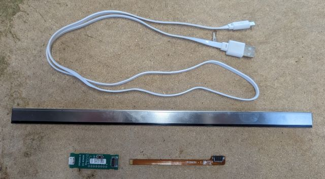
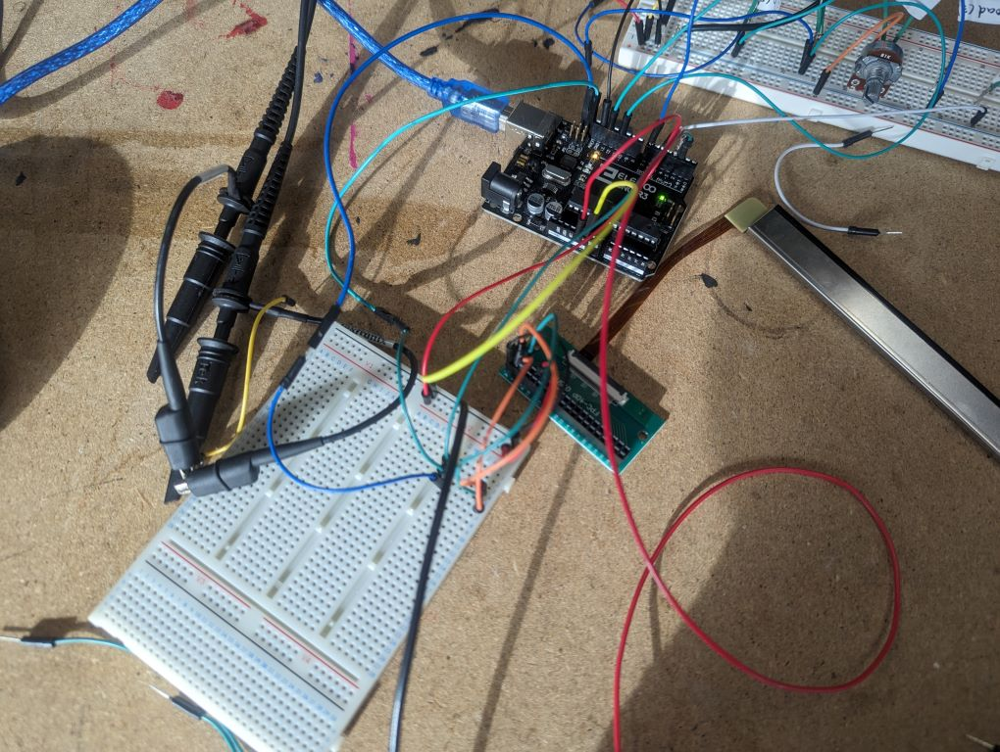

# Hull Bus Terminal Signs: Making Pong on an old Dot-Matrix Display

1. [Introduction](#introduction)
2. [How to connect to a bunch of scary looking electronics](#how-to-connect-to-a-bunch-of-scary-looking-electronics)
   1. [Microchips](#microchips)
   2. [Soldering](#soldering)
   3. [Connected! But it doesn't work](#connected-but-it-doesnt-work)
3. [What is SPI?](#what-is-spi)
   1. [The fix!](#the-fix)
4. [An aside: Neonode touch](#an-aside-neonode-touch)
   1. [The natural conclusion: a theramin](#the-natural-conclusion-a-theramin)
   2. [Theramin + bus sign!](#theramin--bus-sign)
5. [The "Final Project" - Pong!](#the-final-project---pong)
6. [Conclusion](#conclusion)

## Introduction

## How to connect to a bunch of scary looking electronics

### Microchips

### Soldering

### Connected! But it doesn't work

<video controls preload="none" poster="./images/videopre_sign_garbage.jpg" loop>
  <source src="./images/videoff_sign_garbage.mp4" type="video/mp4">
</video>

## What is SPI?

### The fix!

<video controls preload="none" poster="./images/videopre_sign_display-test.jpg" loop>
  <source src="./images/videoff_sign_display-test.mp4" type="video/mp4">
</video>

<video controls preload="none" poster="./images/videopre_sign_scrolling-text_fast.jpg" loop>
  <source src="./images/videoff_sign_scrolling-text_fast.mp4" type="video/mp4">
</video>

## An aside: Neonode touch

<video controls preload="none" poster="./images/videopre_neonode_proto.jpg" loop>
  <source src="./images/videoff_neonode_proto.mp4" type="video/mp4">
</video>

### The natural conclusion: a theramin

<video controls preload="none" poster="./images/videopre_neonode_theramin.jpg">
  <source src="./images/videoff_neonode_theramin.mp4" type="video/mp4">
</video>

### Theramin + bus sign!

<video controls preload="none" poster="./images/videopre_both_jumpy-theramin.jpg">
  <source src="./images/videoff_both_jumpy-theramin.mp4" type="video/mp4">
</video>

## The "Final Project" - Pong!

<video controls preload="none" poster="./images/videopre_both_pong.jpg" loop>
  <source src="./images/videoff_both_pong.mp4" type="video/mp4">
</video>

## Conclusion
