# Hull Bus Terminal Signs: Making Pong on an old Dot-Matrix Display

1. [Introduction](#introduction)
2. [Opening it up](#opening-it-up)
3. [How to connect to a bunch of scary looking electronics](#how-to-connect-to-a-bunch-of-scary-looking-electronics)
   1. [Ribbon cable](#ribbon-cable)
   2. [Soldering](#soldering)
   3. [Connected! But it doesn't work](#connected-but-it-doesnt-work)
4. [What is SPI?](#what-is-spi)
   1. [The fix!](#the-fix)
5. [The "Final Project" - Pong!](#the-final-project---pong)
6. [Conclusion](#conclusion)
7. [Links](#links)

## Introduction

Several weeks ago I wandered into [Hull Makerspace] to see what it was like. At the time the only Makerspace ([what is a Makerspace?]) I had been to was [fizzPOP] in Birmingham, so I wanted to see what others were like. After reading about computing pedagogy in some [magazines][Hello World magazine] I found, I stumbled across an interesting looking GitHub repository on Hull Makerspace's [linktr.ee][Hull Makerspace] (as of now it's no longer there). It was titled "Bus Terminal Signs" and the initial readme contained only the lines:

`Everything we found out about these signs and Arduino code to drive them`

`This is a work in progress.`

The only thing I knew about "bus terminal signs" was that for a few years, the ones at Hull's bus station were broken, with the solution of printed A4 paper with bus timetables stuck to each door. Eventually, they were replaced by LED screens. (Personally, I think dot matrix displays are great and shouldn't be replaced under the reasoning that they're 'old technology', as commenters suggest [here][Euston departure boards].)

I asked the Makerspace staff, and they told me that my suspicions were correct, and when the bus station had ditched the old signs for good, they had asked Hull Makerspace if they wanted the (broken) signs. Of course, they said yes. A year or so ago the Makerspace had given them out to members, but they still had two or three hidden behind some workbenches, so they pulled one out for me behind the scenes. Here it is!

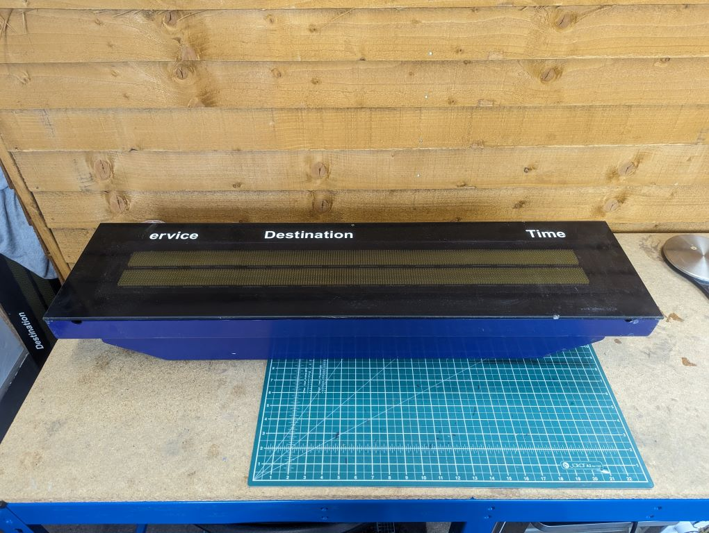

I had a bit of a deeper look into the [`Bus Terminal Signs` GitHub repository][ConnectedHumber/Bus-Terminal-Signs#original] and saw that [Paul Richards] and [Brian Norman] had documented part of their work with the signs, including datasheets, images, and code to interface with the chips on the signs. Knowing what I knew about electronics, C, and hardware, I saw this as a great opportunity for a self-contained and fun project I could work on at the Makerspace! My initial ambitions were that: I wanted to set up the signs myself and get them displaying pixels and/or text; and I wanted to document the process a bit more, so that others who had taken signs home could understand more easily how to use them.

The end result was that I improved the original documentation, and it is now hosted on the same repository: [ConnectedHumber/Bus-Terminal-Signs]! On there is a step-by-step guide on setting up the signs as well as many images. On the rest of this page, I will go into a bit more depth (and in a bit more of a storytelling theme) on my electronical adventure with the signs :)

## Opening it up

The first step was to... take it all apart and look at the wires! With only four allen-key twists, we got the sign open to have a better look inside. Here's what it looks like open, with the LED panels lifted on their hinge:

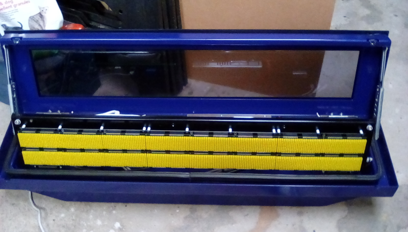

Inside there are a [lot of electronics][ConnectedHumber/Bus-Terminal-Signs#control-module]. There were two leads coming out of the box: a severed 3-core power cable; and an Ethernet cable. I had initially considered trying to hack into the Ethernet cable by sending the "correct" requests, and maybe the sign would *magically work*. This would probably not happen, so instead I wired directly into the microchips controlling the LEDs!...

## How to connect to a bunch of scary looking electronics

Here is a zoom of the sign. As you can see, the LEDs come in panels, which are removable. Under each panel are four microchips (called AS1100 chips - [datasheet][AS1100 datasheet] for the strong-hearted) for controlling the lights. These are wired up so that each chip controls a 6 x 8 pixel grid, and there are four of these per LED panel.

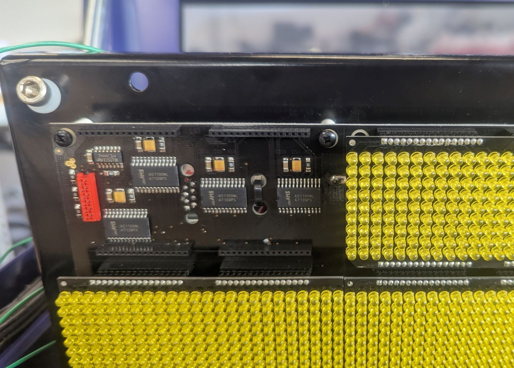

<figcaption>

One panel is 24 x 9 pixels. The bottom row isn't used, leaving four 6 x 8 grids, which each of these four chips controls.

</figcaption>

The AS1100 chips are daisy-chained together, so you only have to attach wires to the input of the first chip, and then it outputs a delayed signal into the input of the next chip. All-in-all, 32 chips are daisy-chained together on the top row, and the same on the bottom. The rows are controlled independently. This is shown as a diagram in the [AS1100 datasheet]


<figcaption>

A curious note: the AS1100 chips are actually *not* designed to drive dot-matrix displays, but instead "*should*" be used for 7-segment displays. Their ability to drive dot matrix displays is just secondary and covered in this single diagram in the datasheet.

</figcaption>

So...! We only need to wire into the first chip.

### Ribbon cable

Handily, there is already a ribbon cable, connecting from the PCB containing the chips (above) to the aforementioned ["bunch of electronics"][ConnectedHumber/Bus-Terminal-Signs#control-module] (below).

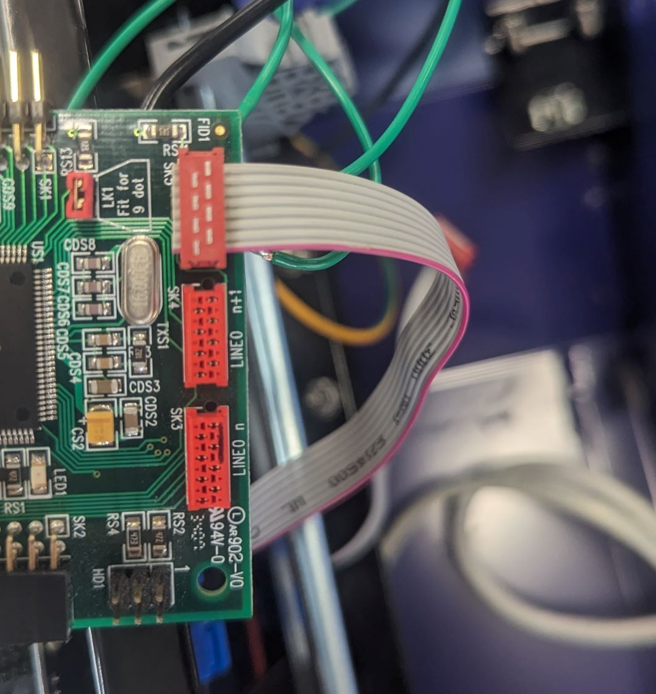

It was already worked out which ribbon cable pins connect to which terminals on the AS1100 chips by BNNorman ([Ribbon cable pin designation]), so all I had to do was figure out a way to connect the ribbon cable wires to an [Arduino][Arduino Uno Rev3]. Without ordering any parts online, the easiest way I could think to do that was to... just solder straight onto the back of the pins of the ribbon cable connector.

I initially marked the cable-to-solder-pad mapping the wrong way round (I had the first pin on the bottom right), but using a multimeter, I noticed it was wrong. I probably should've realised that just like the red marking on the ribbon cable designating wire 1, the square soldering pad on the PCB also designated pin 1. If you imagine it, though, this means there are some funky Z-shaped wires inside the connector to make the pins connect to the opposite side that they entered in. Weird.


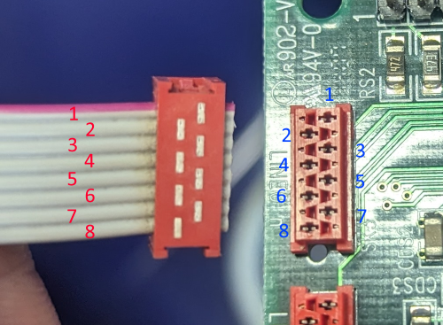

### Soldering

To solder some wires onto the PCB, I first had to have some wires. Revolutionary. So I cut some lengths from wire coils, stripped them, tinned them, and crimped them (all skills which Hull Makerspace was more than glad to help with).

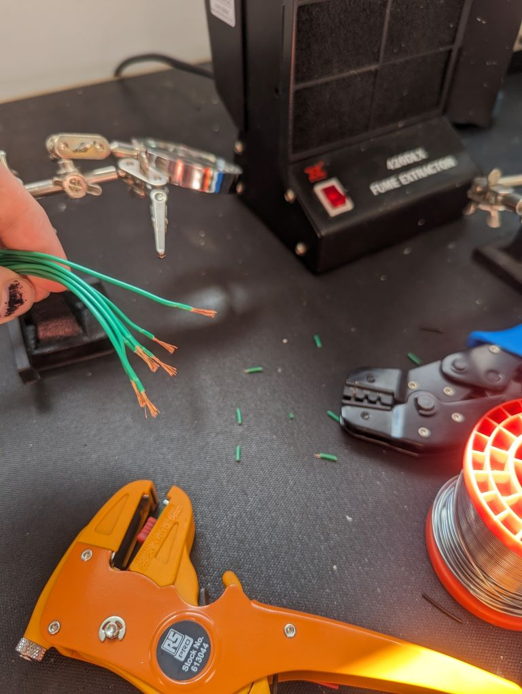

And the final soldering. As they say, "you shouldn't use solder for strength", but hey... I can pick up this circuit board by just the wires now. They only came off three times when I did that.

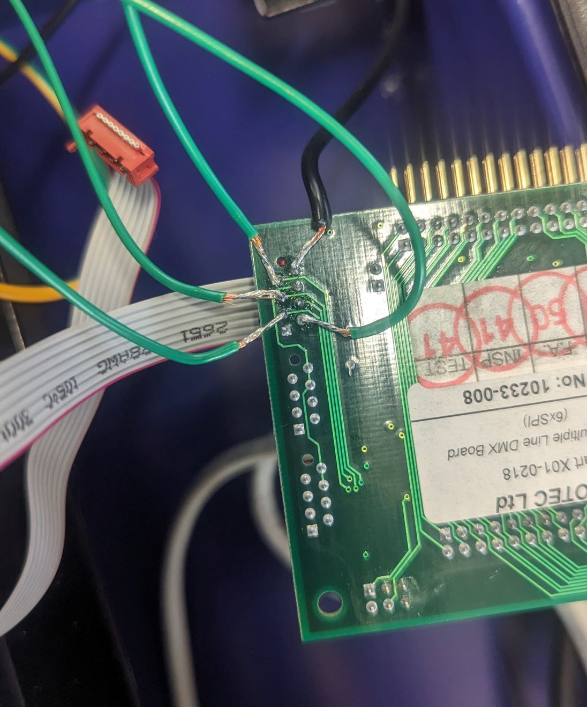

<figcaption>

Wires soldered to pins 2, 3, 5, 7, & 8

</figcaption>

These wires are only for controlling the logic of the chips. The LEDs are powered separately. So, the only connections we need here are:

- Ground
- ISET (sets the brightness of the LEDs)
- DATA (for sending data packets)
- CLOCK (for synchronising data sending)
- LOAD (for telling the chip when we have finished sending data)

In other words, this is [SPI communication][SPI]! I hadn't used SPI before, and so had to learn how it worked, as you'll see below.

After soldering, we can put it together and connect the wires to the sign (as well as connecting power to it)...

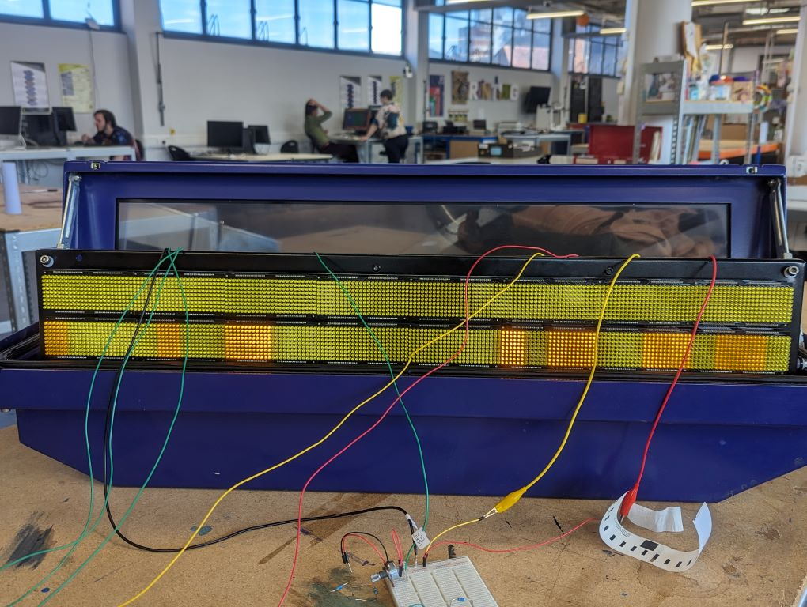

<figcaption>

Looking like a Frankensteinian machine with all those wires.

</figcaption>

...and connect the control/logic wires to the Arduino, so we can send data to the chips...

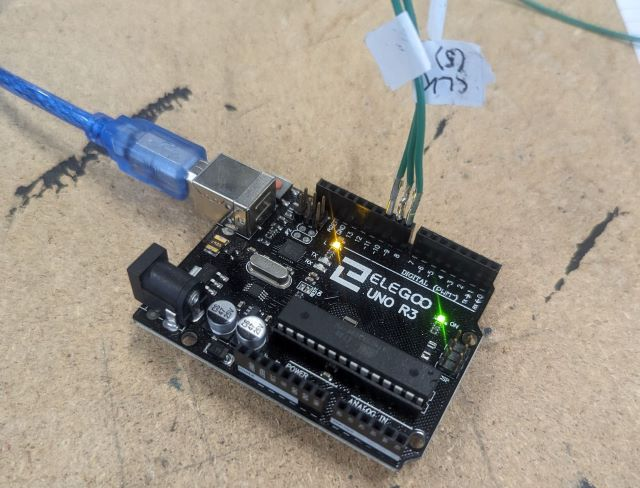

<figcaption>

The contact-anxious among you will be glad to know I moved these wires further apart later on.

</figcaption>

...and that's all that should be needed! Now we just program the Arduino with [some code][Example code: display test], and it should work!

### Connected! But it doesn't work

Lights! This was the first time I got the sign to light up. Unfortunately it lit up completely randomly and with no clear logic, but hey! Lights!

<video controls preload="none" poster="./images/videopre_sign_garbage.jpg" loop>
  <source src="./images/videoff_sign_garbage.mp4" type="video/mp4">
</video>

<figcaption>

You never know. Enough of these could be a funky backdrop to a DJ set.

</figcaption>

This was the end of the journey beginning "let's plug it in and see if it immediately works", with the sad answer of "it doesn't". Now, it was time for some investigative electronics, i.e., sticking an oscilloscope to things and seeing what happens.

## What is SPI?

All about SPI! With only the datasheet in-hand, I started in the dark corner of "I have no idea what SPI is", and played around with an oscilloscope until I understood what was happening.

SPI (Serial Peripheral Interface) is a way for one piece of electronics to send messages to another one, used mainly for devices that are physically next to each other and always attached with the same wires. One device is a "host" and the other a "listener".

Here is the explanation of SPI from the [AS1100 datasheet]. My explanation follows.


SPI communication had been set up in the [original][ConnectedHumber/Bus-Terminal-Signs#original] code by using "bit banging", where wire signals are changed to **HIGH** and **LOW** using Arduino code. I wanted to change this to use Arduino's SPI library, as it is faster and less error-prone, but first I had to understand SPI. So, Hull Makerspace found me an oscilloscope. This, I attached to two SPI wires, **CLOCK** and **DATA** (explained below), to see what was happening when the Arduino sent a signal to the bus sign.

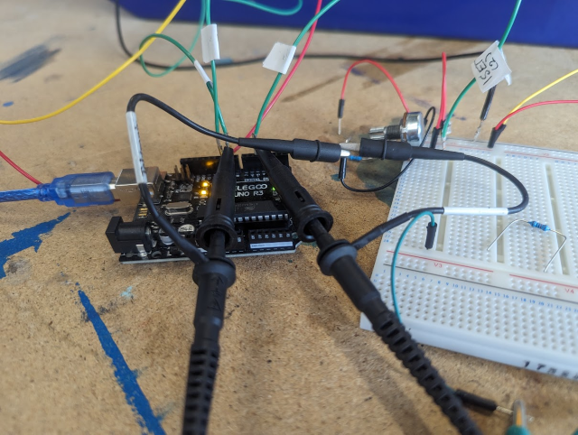

<figcaption>

Probes.

</figcaption>

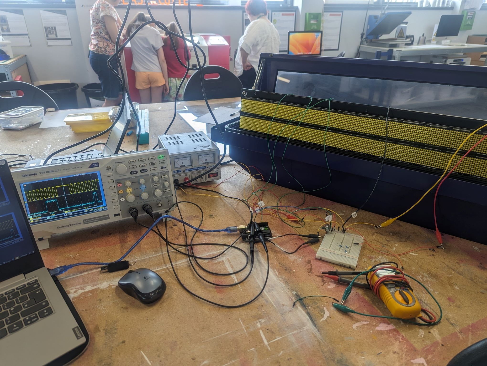

<figcaption>

Probes, et al.

</figcaption>

For SPI, there are three wires. A *clock* wire, a *data* wire, and a *load* wire. When the **host** wants to send a message (2 bytes), they oscillate the *clock* signal up and down 16 times (16 bits), and each time it goes up they put the *data* wire to the corresponding bit of the byte(s). I used the Arduino to send the SPI signal 0x0E02 (0000 1110 0000 0010), and the voltage on the wires looked like this:


<figcaption>

Top, yellow: clock signal. Bottom, blue: data signal. Grey vertical lines: rising edge of the clock signal, which triggers the device to read from the data line. See that 0x0E02 is encoded in the blue signal as 0000&nbsp;1110&nbsp;0000&nbsp;0010.

</figcaption>

So, it looked like the SPI was working! In fact, it was. The real problem was that the voltage was too low. It needed to be 5 V to be registered by the bus sign, and as you can see above, it was anywhere from around 3 to 4 V. This meant that only some peaks in the above signal were registered by the sign, so it was basically receiving rubbish. That explained the flickering.

The root cause of this problem was that the Arduino wasn't grounded to the same ground as the bus sign, and as soon as I connected the common grounds the signal corrected itself, and became the below. Nice and neat.

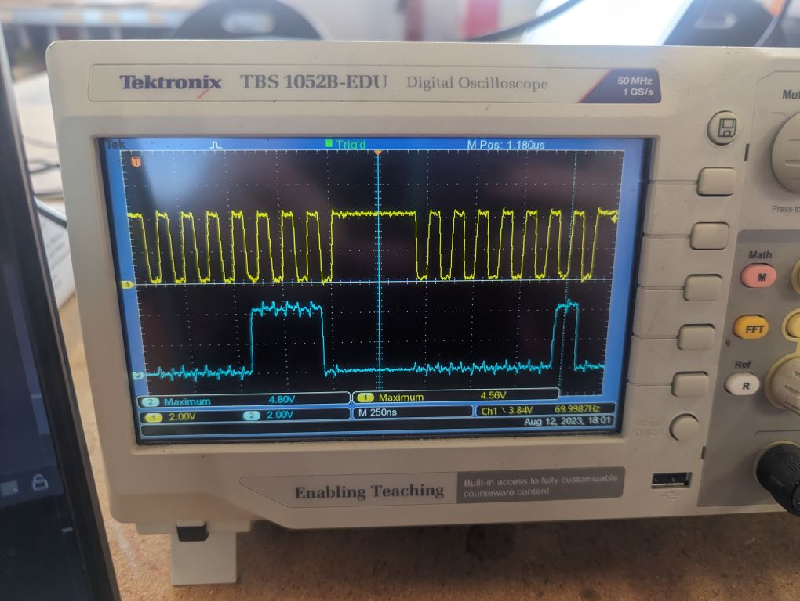

<figcaption>

One SPI message, taking up the whole screen. Top, yellow: clock signal. Bottom, blue: data signal.

</figcaption>

With this 5 V signal, the sign worked perfectly, so it turned out there was nothing wrong with the code. However, at this point, I had spent almost two days figuring out how SPI works, so I [changed the code to use Arduino's native SPI][ConnectedHumber/Bus-Terminal-Signs#adding-spi] anyway. It ended up being only a couple of lines:

```arduino
void Panel::write16(int d) {
  SPI.beginTransaction(SPISettings(10000000, MSBFIRST, SPI_MODE3));
  SPI.transfer16(d);
  SPI.endTransaction();
}
```

Finally, the third wire in SPI is used for confirmation. You can have multiple devices connected to your **CLOCK** and **DATA** signals, and then you can send a final signal on the **LOAD** wire of a specific device to make it process the signal. This can be seen on this trace:

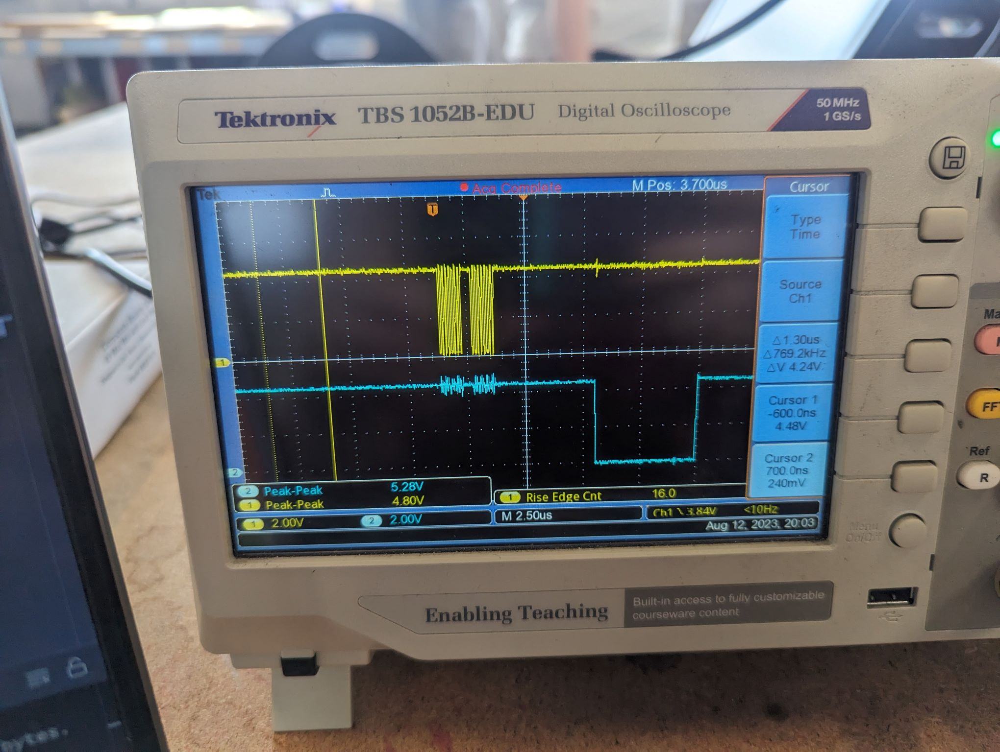

<figcaption>

The same SPI message from above but with LOAD instead of DATA, zoomed out. Top, yellow: clock signal. Bottom, blue: load signal. The load signal is sent with software, so takes longer than the internal SPI communications.

</figcaption>

### The fix!

Now that SPI was fixed, after not actually being broken, I could start using the sign as intended: as a customisable dot matrix display! The first thing was to make sure it worked, so I sent the debug command which flashes on/off all the LEDs, and...

It worked!

<video controls preload="none" poster="./images/videopre_sign_display-test.jpg" loop>
  <source src="./images/videoff_sign_display-test.mp4" type="video/mp4">
</video>

<figcaption>

In Morse, is this eeeeeee or ttttttt?

</figcaption>

Now that the sign worked, the [documented library code][ConnectedHumber/Bus-Terminal-Signs#library] could be used to make a [simple script][ConnectedHumber/Bus-Terminal-Signs#scrolling-text] to scroll the screen with text:

```arduino
#include <CH_AS1100.h>

#define LOAD_PIN_TOP 7 // top panel
#define LOAD_PIN_BOT 5 // bottom panel
#define NUM_CHIPS 32 // panel length

Panel topRow = Panel(LOAD_PIN_TOP, NUM_CHIPS);
Panel bottomRow = Panel(LOAD_PIN_BOT, NUM_CHIPS);

void showText(Panel &p, char *msg)
{
    p.setCursor(0, 0);
    p.setTextColor(1);
    p.setTextSize(1); // pixel size multiplier
    p.println(msg);
    p.display();
}

void setup()
{
    topRow.begin();
    bottomRow.begin();

    showText(topRow, (char *)"Hull Makerspace");
    showText(bottomRow, (char *)"@alifeee");
}

void loop()
{
    topRow.scrollRows(1, true); // wrap scroll left to right
    topRow.display();
    bottomRow.scrollRows(-1, true); // wrap scroll right to left
    bottomRow.display();
}
```

And there we go!

<video controls preload="none" poster="./images/videopre_sign_scrolling-text_fast.jpg" loop>
  <source src="./images/videoff_sign_scrolling-text_fast.mp4" type="video/mp4">
</video>

<figcaption>

Ignore the dead pixel. I [fixed that](https://github.com/ConnectedHumber/Bus-Terminal-Signs/commit/1c7fe0c121c2975fd823975c814084656c6ecbe9) eventually.

</figcaption>

## The "Final Project" - Pong!

Now that I could use the sign fairly effectively, I wanted to get something cool set up. I had originally wanted to set up a server on the sign so that anyone could connect and change the text, so that it could be displayed somewhere. However, my friend John had just given me a ["touchless touch sensor"][Neonode-touch-sensor], so another friend suggested I make Pong with this touch sensor as a controller.

The way time works had meant I only had one day to make the game, so I got stuck in. The first thing I did was plan the game in pseudocode. Here's a snippet of the [full thing][pong pseudocode], with (most of) my plan for the game loop.

```text
...

# game loop (every frame)
compute delta
deal with touch events
  for each event
    get player
    get y
    set player position to y
deal with ball
  work out ball's next position
  if off top of screen
    reverse y velocity
    set position to top of screen
  ...
  add velocity to ball position
clear pixels
draw paddles
draw ball
send display()
```

I used this to write the code in Arduino's language, and it basically... just worked :) Here's the result!

<video controls preload="none" poster="./images/videopre_both_pong.jpg" loop>
  <source src="./images/videoff_both_pong.mp4" type="video/mp4">
</video>

<figcaption>

v0.4.0? More like v1.0.0. Endless fun to be had.

</figcaption>

Finally, I left the game set up in the Makerspace for a few weeks, so anyone could play it if they wanted.


<figcaption>

The power supply powers the sign, and the laptop powers the Arduino. Pong!

</figcaption>

## Conclusion

Pong! The signs were pretty fun to get working and use, and I now have many ideas and other things I want to do with them. Some things I want to do are:

- Set up a sign with a QR code attached, which lets you change the text displayed on a whim (e.g., by using a Raspberry Pi instead of an Arduino, which can use Wi-Fi to host a server with the tool to change the text)
- Using it to show the next train/bus departures, returning it to its initial use (just like the [Desktop Departures® Board])
- Make more games! For example: that tower stacking game where the tower gets thinner if you mistime the stacking; Tetris.
- Anything else! Got any ideas?

It would also be nice to close the lid of the display, so it is portable. When they were uninstalled from the bus station, the power cables were all cut off, so the main part of this is just rewiring a 3-pin plug onto the box.

Screwing around with this sign has been great contained electronical shenanigans! E-waste no more.

## Links

- Main Bus Sign Repository:

    <https://github.com/ConnectedHumber/Bus-Terminal-Signs>

- Documentation for the custom C++ library to control the signs:

    <https://www.connectedhumber.org/Bus-Terminal-Signs>

<!-- links -->
[Hull Makerspace]: https://linktr.ee/makerspacehull
[fizzPOP]: https://fizzpop.org.uk/
[what is a makerspace?]: https://www.makerspaces.com/what-is-a-makerspace/
[Hello World magazine]: https://helloworld.raspberrypi.org/
[Euston departure boards]: https://www.ianvisits.co.uk/articles/euston-station-testing-new-departure-display-boards-58759/
[ConnectedHumber/Bus-Terminal-Signs#original]: https://github.com/ConnectedHumber/Bus-Terminal-Signs/tree/924d6c9f16a497d58154f33e4dc9a63ff28e7344
[Paul Richards]: https://github.com/ConnectedHumber/Bus-Terminal-Signs/blob/924d6c9f16a497d58154f33e4dc9a63ff28e7344/Code/CH_AS1100.cpp#L3
[Brian Norman]: https://github.com/BNNorman
[ConnectedHumber/Bus-Terminal-Signs]: https://github.com/ConnectedHumber/Bus-Terminal-Signs/
[ConnectedHumber/Bus-Terminal-Signs#control-module]: https://github.com/ConnectedHumber/Bus-Terminal-Signs/blob/8442f09b8f9d1832f875e6f604bd82d333bfda3f/pics/Control%20Modules.png
[AS1100 datasheet]: https://github.com/ConnectedHumber/Bus-Terminal-Signs/blob/master/Datasheets/AS1100_DS000273_1-00.pdf
[Ribbon cable pin designation]: https://github.com/ConnectedHumber/Bus-Terminal-Signs/#pin-designation
[Arduino Uno Rev3]: https://store.arduino.cc/products/arduino-uno-rev3
[SPI]: https://en.wikipedia.org/wiki/Serial_Peripheral_Interface
[Example code: display test]: https://github.com/ConnectedHumber/Bus-Terminal-Signs/blob/master/Code/Examples/display_test.ino
[ConnectedHumber/Bus-Terminal-Signs#adding-spi]: https://github.com/ConnectedHumber/Bus-Terminal-Signs/commit/42d419e2f393794e35022eb3a698ca0bd0645b34
[ConnectedHumber/Bus-Terminal-Signs#library]: https://www.connectedhumber.org/Bus-Terminal-Signs/html/index.html
[ConnectedHumber/Bus-Terminal-Signs#scrolling-text]: https://github.com/ConnectedHumber/Bus-Terminal-Signs/blob/master/Code/Examples/scrolling_text.ino
[Neonode-touch-sensor]: https://neonode.com/technologies/zforce/touch-sensor-modules
[pong pseudocode]: ./pong%20plan.txt
[Desktop Departures® Board]: https://ukdepartureboards.co.uk/store/product/desktop-departures
