# Making my own Font - BogFace

<word-count parent=".markdown-body"></word-count>

I was told by a friend that they had never woken up and thought "I want to make a font".

However, I had done exactly that.

BogFace, available for download [NOW](https://alifeee.co.uk/fonts)!

<!-- Rounded switch -->

    <fieldset>
        <label for="bogswitch">Read this post in BogFace</label>
        <label class="switch">
            <input type="checkbox" name="bogswitch" id="bogswitch-1">
            
        </label>
    </fieldset>

1. [Why?](#why)
   1. [Moving away from font repositories like Google Fonts](#moving-away-from-font-repositories-like-google-fonts)
2. [How to make a font?](#how-to-make-a-font)
   1. [Picking a tool to use](#picking-a-tool-to-use)
   2. [Learning how to use FontForge](#learning-how-to-use-fontforge)
   3. [Making a typeface](#making-a-typeface)
      1. [Converting hand-drawn images into two-colour bitmaps](#converting-hand-drawn-images-into-two-colour-bitmaps)
   4. [Loading in the bitmaps to FontForge](#loading-in-the-bitmaps-to-fontforge)
   5. [Drawing round the designs](#drawing-round-the-designs)
   6. [Why did I call it BogFace?](#why-did-i-call-it-bogface)
   7. [Font completion!](#font-completion)
   8. [Adding more things](#adding-more-things)
3. [The leftovers](#the-leftovers)
4. [Footnotes](#footnotes)
5. [Resources](#resources)

## Why?

I think design is fascinating, and I have read a few books about fonts. One is [Why Fonts Matter](https://www.goodreads.com/en/book/show/25658538),

<a class="why-fonts-matter hover-area" href="https://www.goodreads.com/en/book/show/25658538">
    

    

</a>

which posed a fun experiment of asking "how many different fonts am I exposed to in an hour?". I often remember this, and look around, and it's often *a lot* of fonts.

Another book, which I still own, is [Script Fonts](https://www.goodreads.com/book/show/26246257-script-fonts),

<a class="script-fonts hover-area" href="https://www.goodreads.com/book/show/26246257-script-fonts">
    

    

</a>

which is simply a list of many fonts. The fonts are put into collections and each has a brief preface, but otherwise the book is... just fonts. Plain and simple. It even comes with a CD containing all the fonts! I don't have a CD drive.

### Moving away from font repositories like Google Fonts

I think using non-default fonts on websites is always fun, and I recently started straying away from the fonts on Google Fonts and similar sites. This was part of my broader departure from the advertiser-filled, SEO-optimised, tracking-fueled Internet to the cooler, calmer, and altogether more personable [IndieWeb](https://indieweb.org/).

I enjoy [many personal websites](https://alifeee.co.uk/bookmarks/), and I knew of two that specifically had fonts: [Tom7's fonts](http://fonts.tom7.com/) (a website I discovered via [Tom7's YouTube channel](https://www.youtube.com/@tom7)),

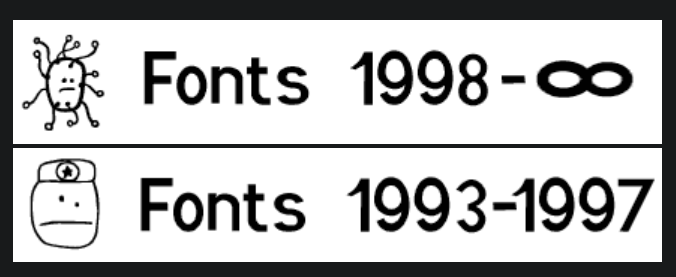

<figcaption>

<http://fonts.tom7.com/>

</figcaption>

...and [Des polices de caracteres a Gogo](http://clofont.free.fr/) (I found this site, a French website, mostly in French, with [Robyn](https://alifeee.co.uk/i-am-having-a-good-blow-at-cheltenham/) - I do not remember how or where, but it was probably browsing [webrings](https://alifeee.co.uk/bookmarks/#webrings)).

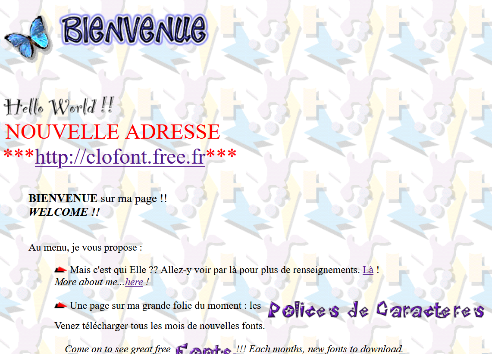

<figcaption>

<http://clofont.free.fr/>

</figcaption>

Tom7's site has two pages of fonts, with maybe 30 fonts total. The second French site I have not yet found the bottom of, and has seemingly hundreds and maybe thousands of fonts. Over a few weeks, I found myself making [one](https://webring.alifeee.co.uk/) or [two](https://github.com/alifeee/invoice_template/) things, and when I thought "I should pick a font for this", the natural choice was to use one from one of these personal sites. So, that's what I did!

## How to make a font?

### Picking a tool to use

After that, fonts were on the mind, so I decided to learn how to make them. [Tom7's font FAQ](http://fonts.tom7.com/faq.html) (seemingly written over 20 years ago) suggested that making a font might be quite inaccessible, requiring expensive, bespoke software.

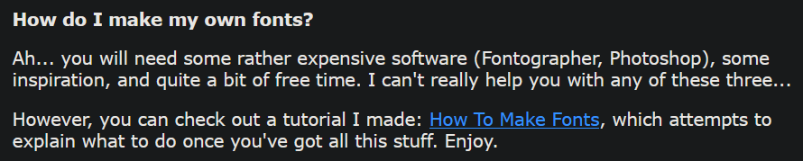

<figcaption>

FAQ from [Tom7's font FAQs](http://fonts.tom7.com/faq.html).

</figcaption>

However, I googled around (using my all-too-common method of prepending the phrase "FLOSS open-source" to whatever premium experience I was after) and found [FontForge](https://fontforge.org/en-US/) and [Birdfont](https://birdfont.org/). I decided I would use the former, FontForge, as it seemed more mature (whatever that means).

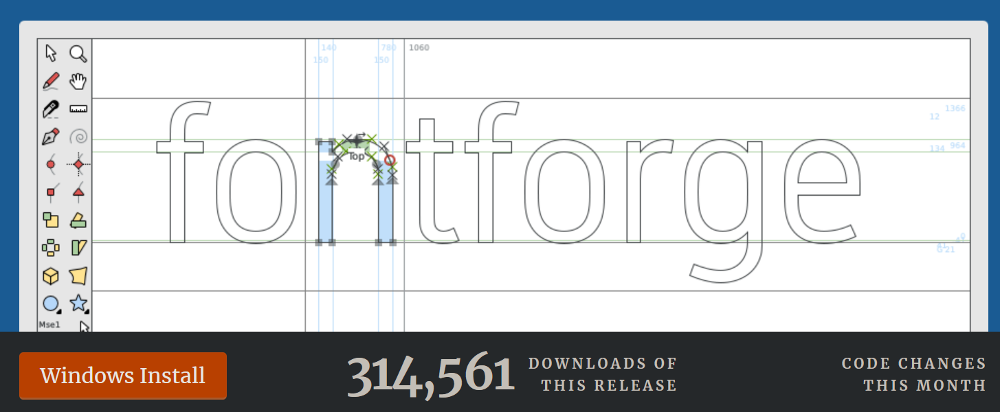

<figcaption>

[FontForge](https://fontforge.org/en-US/)'s main page.

</figcaption>

### Learning how to use FontForge

With not much to do, I spent the better half of a Boneless Wednesday[¹](#footnotes) reading the [FontForge documentation](https://fontforge.org/en-US/documentation/). As well as teaching you how to use FontForge itself, there was a lot of information about how typefaces in general are rendered by computers, and the differences for different writing systems like Arabic and Mandarin. It is interesting stuff, especially if you're into typography (I have not decided whether I am or not, but evidence would sway me towards being).

### Making a typeface

I started by making hand-painted letters into part of a font with the [Kiran Builder Typeface](https://github.com/alifeee/kiran-builder-typeface) (currently incomplete), a font based on a painted garage in East London. With that small project I developed a process for turning images of hand-drawn letter forms into vector graphics, which is the graphics format used for fonts. I will lay that process out here.

#### Converting hand-drawn images into two-colour bitmaps

Fonts are single-colour, and then can be painted afterwards. So, to get from an image to vector graphics, I first converted the image to a 2-color bitmap. For this I used [Paint.Net](https://www.getpaint.net/) (the program I use for all raster image editing - think a more powerful MS Paint), and used `Effects>Colour>Quantize` to turn my photos into black-and-white PNGs (a simplified story. The extra steps were cleaning up things like the lines from the lined paper I used and other pen-marks.)

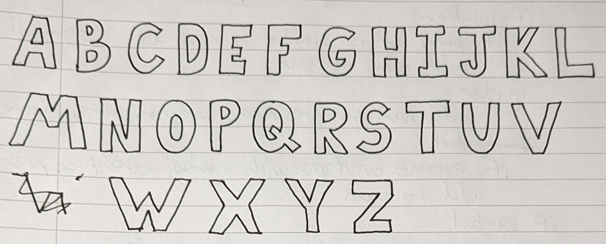

<figcaption>

The uppercase letters that I drew on lined paper (use blank next time) to use in my font.

</figcaption>

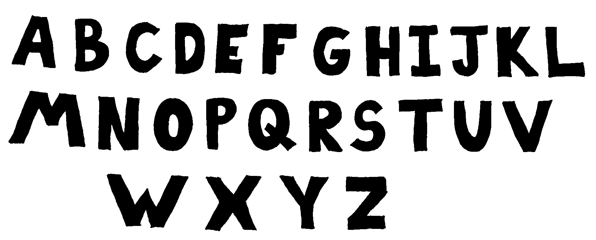

<figcaption>

A quantized version of the image above, after I cleaned it up in Paint.Net.

</figcaption>

Then, I cropped each symbol into its own file, so that I could import them into FontForge.

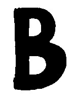

<figcaption>

B.

</figcaption>

### Loading in the bitmaps to FontForge

I was sure I read a thing in the documentation about importing an entire folder of files ("a.png", "b.png", "c.png", ...) in one go, but I couldn't re-find it (the problem with reading documentation I guess?), so I just used the arrow keys to go from letter to letter and `CTRL+SHIFT+I` to import an image into each one.

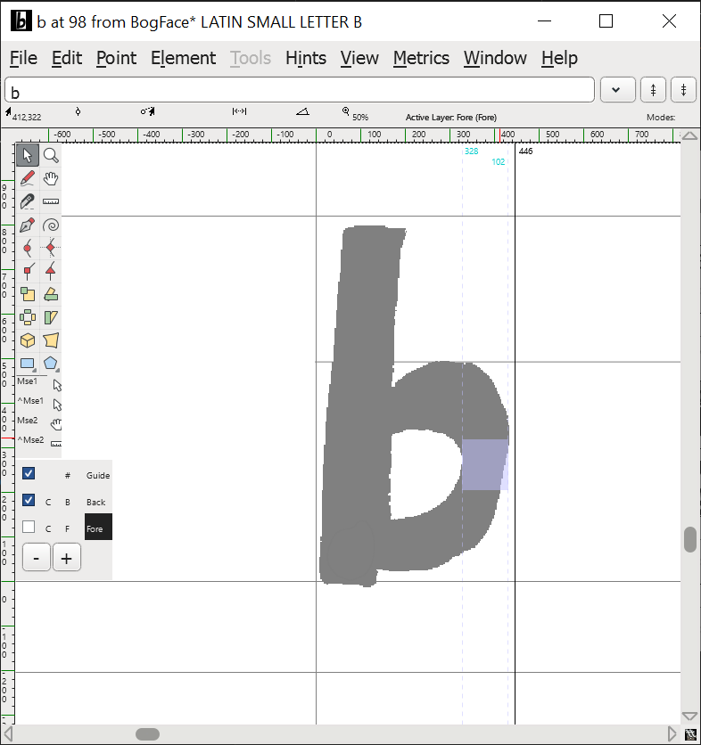

<figcaption>

FontForge's [outline window](https://fontforge.org/docs/ui/mainviews/charview.html), with my hand-drawn ***b*** set to the background image.

</figcaption>

### Drawing round the designs

Then, I started manually tracing the images with Bézier curves.

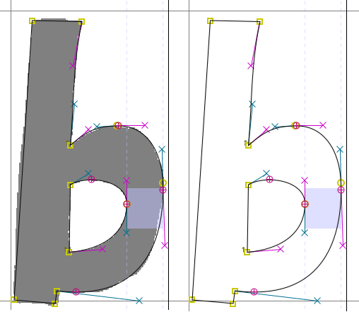

<figcaption>

Look how neatly those Bézier points are placed around that letter. Mmm.

</figcaption>

This took a while. After around 10 letters, I started using [`potrace`](https://potrace.sourceforge.net/) via the FontForge UI to automagically trace round my letters. Then, I found a FontForge command called simply `simplify` which removed most of the Bézier points, giving the final letter a cleaner look. In the end, this process amounted to repeatedly pressing `CTRL+SHIFT+T` (autotrace), `CTRL+SHIFT+M` (simplify), `CTRL+M` a bunch (removing points), and then `CTRL+[` (go to next character).

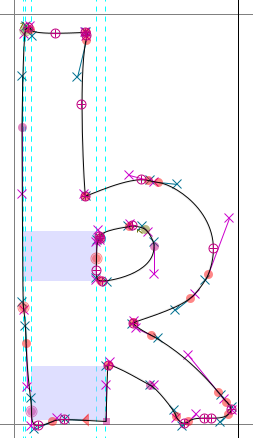

<figcaption>

This one looks a lot more scruffy. But it did only take about 20 seconds to make.

</figcaption>

This worked fine for me for two reasons:

- I was just tracing a hand-drawn font, rather than designing a font on a PC. This would involve a lot more fiddling around.
- I did not care about consistent letter sizes/thicknesses/widths. This would involve a lot more fiddling around.

### Why did I call it BogFace?

When I started doing lowercase letters, I had to decide a few things:

- the height of small letters (i.e., o, e, r, etc.)
- the height of "ascenders" (i.e., h, b, l)
- the "height" of "descenders" (i.e., "y")

I pulled in three letters to my font-window to decide this: o, g, and b. Since I was doing this at the [hackspace](https://blog.alifeee.co.uk/hackspace-adventures/) (I was working on it on-and-off over a few days), someone leaned over and read out the three large letters on my screen, which I was too busy thinking about ascenders and descenders to parse.

"**bog?**", they inquired.

"yes", I replied.

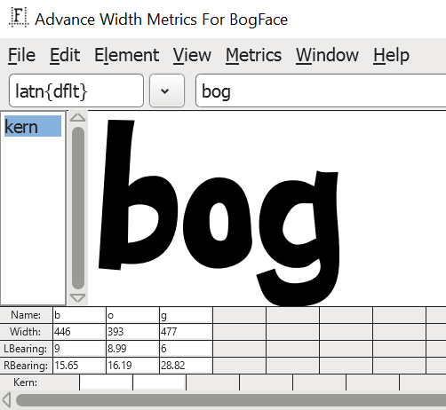

<figcaption>

bog.

</figcaption>

This, combined with the facts that "I thought the font looked a little boggy", and "I fell in a bog on a [trip to Scotland](https://alifeee.co.uk/scotland-trip/) this summer" solidified what I was going to call my as-yet-unnamed typeface: BogFace.

(I only check this as of writing (if you want to make something: don't google it to check if it exists - just make it), but it [seems like](https://www.google.com/search?q=%22bogface%22+font) there was not already a typeface on the Internet called the same.)

### Font completion!

Eventually, I made all 26 Latin uppercase and lowercase letters. I also made some symbols.

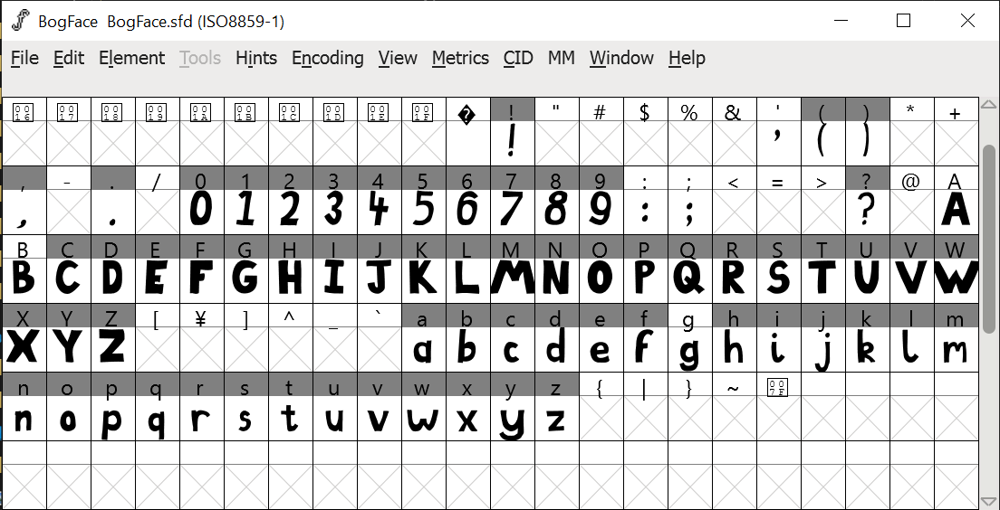

<figcaption>

This is the main window of FontForge when you are editing your font. I think it looks quite nice.

</figcaption>

Play with it here! :)

<textarea class="BogFace textarea">bog-me-up</textarea>

### Adding more things

After using BogFace for a bit (including a period of [turning every website to use BogFace by default](./images/wikipedia_bogged.png)), I realised that I wanted numbers, and also that the font looked smaller than normal. This second point was caused by me having a large descender size. Apparently, hand drawn letters naturally have massive descenders, and fonts do not,

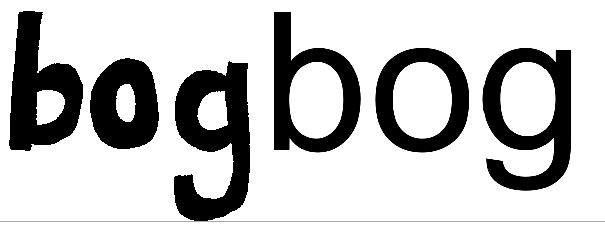

<figcaption>

See how much lower my hand-drawn g descends, compared to a g from a standard font like Arial.

</figcaption>

...so in accommodating my massive descenders, I have made the overall font smaller. This is because there is no way to specify the height of a font (from the "bottom" of a letter to the top). Programs which draw fonts just decide the line-height is the bottom to the top, including the descender. This meant that for BogFace, the normal letters were small because of the extended descender.

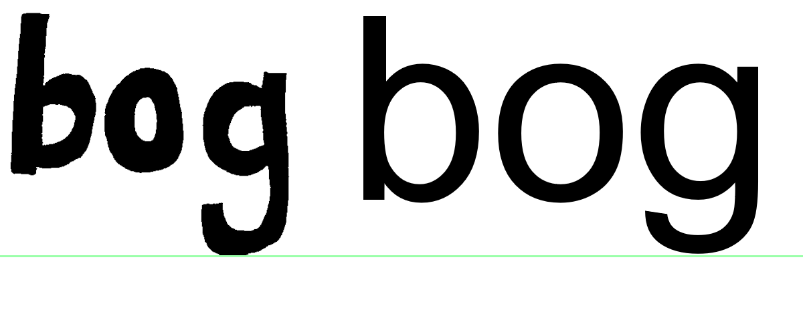

<figcaption>

When you shrink BogFace to be the same size as a normal font, the extended g's make it look a lot smaller than a normal font. It's especially noticeable at smaller font sizes.

</figcaption>

So, I lowered the descender height of the font, and to stop the *loooong* letters having a fight with letters on the line below, also made them shorter graphically.

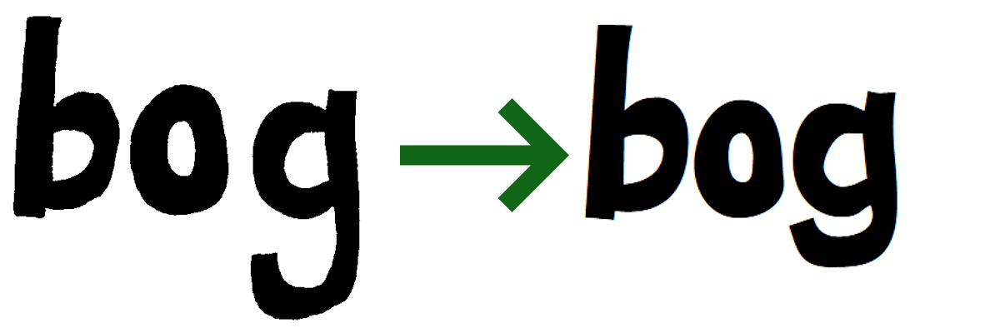

<figcaption>

This change technically reduces the "authenticity" of the font, but a) who was counting, and b) I drew the letters first-try with no design direction anyway.

</figcaption>

## The leftovers

That was it! I tagged it as ["release 1.0.0"](https://github.com/alifeee/bogface/releases/tag/v1.0.0), and if I play with making fonts again, it will be on a new font!

It's fun to have my own font.

After I while (believe it or not), I got tired of having to read every website in BogFace. However, I left it as the default font, but still allowed sites to override it. That means that most of the time, I see sites how they were designed. However, sometimes sites leave certain sections unstyled, intentional or not, so every day I get to play an Easter egg hunt to find BogFace on the Internet.

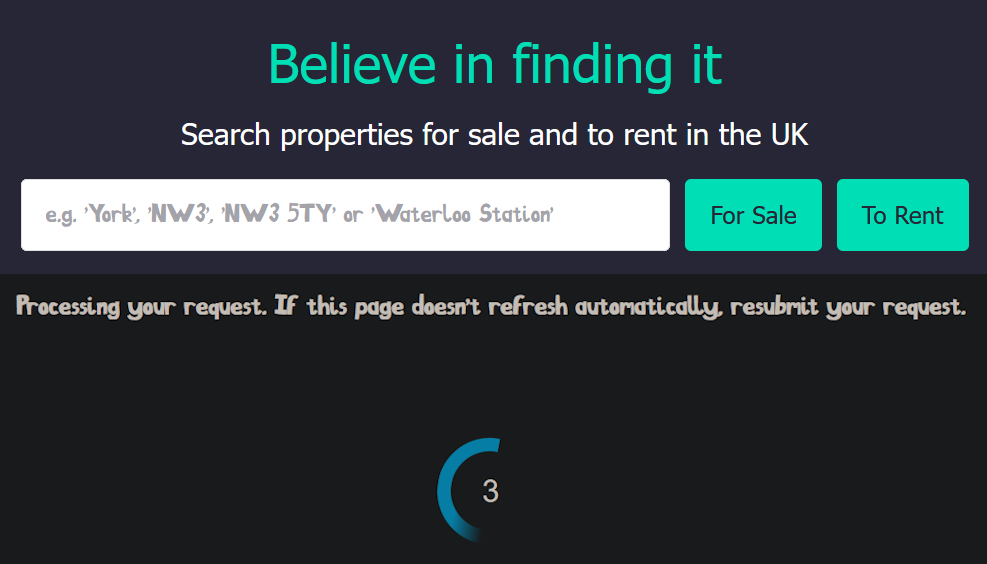

<figcaption>

Some places I've come across my own font in the wild include RightMove and random other websites.

</figcaption>

It's also nice to be able to know that if I need a whimsical typeface, I have one at my fingertips (for example for an [online newsletter](https://liputenpo.alifeee.co.uk/) written entirely in [toki pona](https://tokipona.org/) (link probably broken))

I have not spoken about kerning. It is and was an entire ordeal. I hope you enjoy dealing with it if you choose to make a font.

I will probably make more fonts. If I do make another font, I would like to spend more time designing it, and spend a bit more effort on it beyond "trace a hand-drawn image".

FIN.

## Footnotes

1. Phoneless Wednesday

## Resources

- My new fonts section on my website

    <https://alifeee.co.uk/fonts/>
- FontForge, a free, open-source app for creating fonts

    <https://fontforge.org/en-US/>
