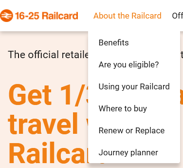

# The difference between a 16-25 and 26-30 railcard

<word-count parent=".markdown-body"></word-count>

Welcome to a semi deep dive on UK Railcards.

This is inspired from the string of questions and answers of:

<!-- omit in toc -->
## When can you stop using a 16-25 railcard?

You can buy a 1-year 16-25 railcard up to the day before you turn 26, so you can use one up to the day before you turn 27.

...or "until you are 27".

<!-- omit in toc -->
## So, should you try to eke it out?

Well, there is a 26-30 Railcard. So, it's pointless trying to game any systems if they are functionally the same.

(spoilers: probably not)

<!-- omit in toc -->
## Are the 16-25 and 26-30 railcards functionally the same?

What a good question! Let's find out. We will be lamenting the difference between the railcard websites, lamenting the difference between the Terms & Conditions, and lamenting the lack of a universal Railcard.

(spoilers: [see the differences](#all-the-differences-between-the-16-25-and-26-30-railcard))

1. [What railcards can you buy?](#what-railcards-can-you-buy)
   1. [All the railcard sites are different](#all-the-railcard-sites-are-different)
   2. [What railcard can you buy: Flow chart](#what-railcard-can-you-buy-flow-chart)
   3. [The Britrail pass](#the-britrail-pass)
   4. [The BahnCard](#the-bahncard)
   5. [A national railcard?](#a-national-railcard)
2. [What's the difference between the 16-25 and 26-30 railcard?](#whats-the-difference-between-the-16-25-and-26-30-railcard)
   1. [The Terms and conditions](#the-terms-and-conditions)
   2. [All the differences between the 16-25 and 26-30 railcard](#all-the-differences-between-the-16-25-and-26-30-railcard)
   3. [When can you use the 16-25 or 26-30 railcards until?](#when-can-you-use-the-16-25-or-26-30-railcards-until)
   4. [Use your railcard on the London Underground](#use-your-railcard-on-the-london-underground)
3. [Conclusion](#conclusion)

## What railcards can you buy?

The [Railcards website][railcards] has a list of all railcards that you can buy. To save you a click, the ones listed there are:

- [16-17 Saver][railcards#16-17]
- [16-25 Railcard][railcards#16-25]
- [26-30 Railcard][railcards#26-30]
- [Disabled Persons Railcard][railcards#disabled]
- [Family & Friends Railcard][railcards#:family]
- [Network Railcard][railcards#network]
- [Senior Railcard][railcards#senior]
- [Two Together Railcard][railcards#twotogether]
- [Veterans Railcard][railcards#veterans]

### All the railcard sites are different

All the websites above are different. They are all about railcards, which are broadly "cards that get you 1/3 off train ticket costs", but each is a completely different website. This means that to compare two cards (as we do below), the link structure and information on each of the pages is completely different. This is kind of annoying.

### What railcard can you buy: Flow chart

I had a look at the eligibility criteria for the railcards, and drew up a flow chart to decide if anyone could buy one or not.

In short: you can probably buy one. However, if you are:

- between 31 and 59 years old
- not living in the South-East of England
- not travelling with another person

...then you probably can't buy one.

I made the flowchart using [tldraw]. Here it is. It contains two railcards not in the URL above: the armed forces railcard and the local railcard, which are listed on the [Wikipedia page for "Concessionary fares on the British railway network"][wikipedia#railcards]. That page doesn't have all the railcards listed, so maybe I should edit it...

Anyway, flowchart:


<figcaption>

This is an SVG export of the flow chart from [tldraw]. [View full screen](./flowchart_tldraw.svg)

Footnotes: (1) [Network Railcard area](https://www.network-railcard.co.uk/download/clientfiles/files/London_South_East_Network_Railcard_map_May2022.pdf) (3) [Local Railcards](https://en.wikipedia.org/wiki/Concessionary_fares_on_the_British_railway_network#Local_railcards)

</figcaption>

I have also turned the flowchart into one made using [Mermaid], which is a way of making diagrams with text (or "code", but that is a scary word). Here is a snippet of the source, and the chart below (rendered by *your* browser!).


<details><summary>View full diagram source</summary>

You can paste this code into the [Mermaid editor]. Or, click [this link][Mermaid editor#withcode] to go to the editor with this pre-filled in.


</details>

<pre class="mermaid full-width-image">
flowchart TD
  R:CHILD[your tickets are 50% off already]:::R
  R:16-17[16-17 Saver!]:::R
  R:16-25[16-25 Railcard!]:::R
  R:26-30[26-30 Railcard!]:::R
  R:SENIOR[Senior Railcard!]:::R
  R:NETWORK[Network Railcard!]:::R
  R:DISABLED[Disabled Persons Railcard!]:::R
  R:FAMILY[Family & Friends Railcard]:::R
  R:TWOTOGETHER[Two Together Railcard!]:::R
  R:ARMEDFORCES[Armed Forces Railcard!]:::R
  R:VETERANS[Veterans Railcard]:::R
  R:LOCAL[Local Railcard!]:::R
  R:NONE[You must pay extortionate prices for a train]:::R

  classDef R color:#c55,fill:none,stroke:none

  Q:AGE[What is your age?]
  Q:NETWORK["are you in the Network Railcard area? (London and the South East) (1)"]
  Q:STUDENT[are you a mature student?]
  Q:OTHERS[Will you be getting trains with other people?]
  Q:DISABILITY[do you have a disability?]
  Q:MILITARY[Do you have any links to the military?]
  Q:ARMEDFORCES[are you a member of the regular armed forces, a reservist, or the partner or depeendent children of the former?]
  Q:WIDOW[are you a war widow or their dependant?]
  Q:VETERAN[are you a Veteran?]
  Q:LOCAL["Is there a local railcard near you? (3)"]

  Q:AGE -->|0-15| R:CHILD
  Q:AGE -->|16-17| R:16-17
  Q:AGE -->|18-25| R:16-25
  Q:AGE -->|26-30| R:26-30
  Q:AGE -->|31-59| Q:NETWORK
  Q:AGE -->|60-∞| R:SENIOR

  Q:NETWORK -->|yes| R:NETWORK
  Q:NETWORK -->|no| Q:STUDENT

  Q:STUDENT -->|yes| R:16-25
  Q:STUDENT -->|no| Q:OTHERS

  Q:OTHERS -->|yes, with no more than 4 adults and 4 children| R:FAMILY
  Q:OTHERS -->|yes, with anothere person over 16 years old| R:TWOTOGETHER
  Q:OTHERS -->|no| Q:DISABILITY

  Q:DISABILITY -->|yes| R:DISABLED
  Q:DISABILITY -->|no| Q:MILITARY

  Q:MILITARY -->|yes| Q:ARMEDFORCES
  Q:MILITARY -->|no| Q:LOCAL

  Q:ARMEDFORCES -->|yes| R:ARMEDFORCES
  Q:ARMEDFORCES -->|no| Q:WIDOW

  Q:WIDOW -->|yes| R:ARMEDFORCES
  Q:WIDOW -->|no| Q:VETERAN

  Q:VETERAN -->|yes| R:VETERANS
  Q:VETERAN -->|no| Q:LOCAL

  Q:LOCAL -->|yes| R:LOCAL
  Q:LOCAL -->|no| R:NONE
</pre>

<figcaption>

This is a live rendered flowchart using [Mermaid]. [View full screen](./flowchart_mermaid.svg). [View online][mermaid online]. See above for footnotes.

I hope this diagram still works when you are reading this. I couldn't easily get it to use local libraries, so it downloads lots of JavaScript from "not this website".

</figcaption>

### The Britrail pass

As a sidenote, I discovered this week about the existence of the [Britrail pass][britrail], which is a rail pass similar to the [Interrail pass][interrail] but just for the UK. It seems a similar price, so could be useful if you want to go on a train adventure in the UK, but you have a UK passport (as Interrail prohibits use in your home country).

### The BahnCard

There is a lot of information in the above flowcharts. In Germany, the flow chart for their [BahnCard][BahnCard] is much simpler, and I can write it as the text:

If you are:

- 6-26 years old: you can get a "My BahnCard"
- 27-64 years old: you can get a BahnCard
- older than 65: you can get a BahnCard for senior citizens


<figcaption>

All the BahnCards available (well, there is also a more expensive 50% off version, a trial version, and the senior citizen version is not shown here)

</figcaption>

Currently, you can also buy a "Fan BahnCard", which gets better if Germany wins the current UEFA EURO football competition. No-loss gambling, I suppose?


This leads on to:

### A national railcard?

The existence of a national railcard would nullify this entire blog post. I'd welcome that.

Quoting my good friend, and reliable source, [Wikipedia][wikipedia#nationalrailcard]:

> Railfuture [...] has been campaigning [...] for a National Railcard to replace the plethora of different railcards. [...]
>
> A study undertaken jointly by Railfuture and the Rail Passengers Council [...] suggested that three million people would buy such a Railcard for £20.00 if it gave a one third discount on off-peak fares.
>
> The "most conservative forecast" indicated that [...] passenger mileage would be increased by 11% per annum and rail industry profits by £50 million.
>
> The profit-maximising combination [...] would increase profits by £70 million.

i.e., a National Railcard would be pretty sweet. We'll see how that goes, considering that study was from 2003.

## What's the difference between the 16-25 and 26-30 railcard?

As I said before, the websites for the [16-25 Railcard][railcards#16-25] and the [26-30 Railcard][railcards#26-30] are annoyingly different, for how similar concepts they are.

Here is a sub-menu from the 16-25 railcard...



...and here is the "same" sub-menu from the 26-30 railcard.


Which of those menu items are you pressing if you want to answer the questions "How old can I be to buy the card?" or "What specific trains can I get?"? It's annoying. It doesn't matter now though, because I found links to the...

### The Terms and conditions

The 16-25 and 26-30 railcards have Terms and Conditions (T&Cs) online:

- [16-25 Railcard Terms and Conditions][tnc#16-25]
- [26-30 Railcard Terms and Conditions][tnc#26-30]

Even these are weirdly different to each other, in formatting and content. I have copied their text and provide the text versions here

- [16-25 Railcard Terms and Conditions (text)](./16-25%20Railcard%20Terms%20&%20Conditions.txt)
- [26-30 Railcard Terms and Conditions (text)](./26-30%20Railcard%20Terms%20&%20Conditions.txt)

I used the diff/compare feature of VSCodium to try and spot the differences between these two texts. But, what I did first was clean them up. They were differently formatted. Here are some differences (I leave it up to you to match each difference to each T&Cs).

- one had spaces at the end of most lines, the other did not
- one used "Data Protection", the other "data protection"
- one used `“”`, the other `''`
- one had a lot of non-breaking spaces `&nbsp;` instead of spaces
- one used "property rights", the other "proporty rights" (bad spelling)

Here are the updated versions after I made the T&Cs more similar to each other in structure:

- [16-25 Railcard Terms and Conditions (text, updated)](./16-25%20Railcard%20Terms%20&%20Conditions_updated.txt)
- [26-30 Railcard Terms and Conditions (text, updated)](./26-30%20Railcard%20Terms%20&%20Conditions_updated.txt)

It should now be more easy to see the differences between them. We can generate a nice diff between these files, using `git diff` like

```bash
git diff --no-index --word-diff=plain -U2 railcard16-25.txt railcard26-30.txt
```

...where `--no-index` enables diffing of files, `--word-diff=plain` diffs words instead of lines, and `-U2` shows 2 lines of context around each diff. The output of this diff is [here](./diff.txt), but I can also turn it into nice-looking HTML by using trickery.

The trickery I used is VSCode's regex find-and-replace to turn `git diff` into more style-able HTML. I followed my own instructions:

- find `\[-(.*?)-\]`, replace `<del>$1</del>`
- find `\{\+(.*?)\+\}`, replace `<ins>$1</ins>` (turns out if you don't escape the second `+` like `\+` you can crash VSCode...)
- find `^(@@.*@@.*)$` replace `<span class="jump">$1</span>`
- wrap header in HTML

Here are the differing parts of the T&Cs!

([skip to "all the differences"](#all-the-differences-between-the-16-25-and-26-30-railcard))

<pre class="pre-wrap" id="tocdiff">
  <p>diff --git a/16-25 Railcard Terms & Conditions_updated.txt b/26-30 Railcard Terms & Conditions_updated.txt
  index d3f5aae..b6b93b1 100755
  <span class="del">--- a/16-25 Railcard Terms & Conditions_updated.txt</span>
  <span class="ins">+++ b/26-30 Railcard Terms & Conditions_updated.txt</span></p>
  <span class="jump">@@ -1,7 +1,7 @@</span>
  <del>16-25</del><ins>26-30</ins> Railcard Terms & Conditions

  1. Introduction

  1.1. These terms and conditions (“Railcard Conditions”) apply to the use of the <del>16-25</del><ins>26-30</ins> Railcard and reduced priced tickets ('discounted tickets') bought with the <del>16-25</del><ins>26-30</ins> Railcard.

  <span class="jump">@@ -17,11 +17,7 @@</span>
  1. General conditions of use of the Railcard

  2.1. <del>If you have a physical Railcard, your</del><ins>Your 26-30</ins> Railcard is <del>not valid, and you cannot use it, until you have signed it.</del><ins>only valid when uploaded to the Railcard app on a mobile device.</ins>

  2.2. The Railcard does not become your property <del>and, if requested:</del>

  <del>2.2.1. You must hand it to a representative of any of the Train Companies, if you have a physical Railcard.</del>

  <del>2.2.2. You must remove it</del><ins>and can be removed</ins> from your mobile <del>device if requested by a representative of any of the Train Companies, if you have a digital Railcard.</del><ins>device.</ins>

  <span class="jump">@@ -41,15 +37,9 @@</span>
  In these cases you will be able to use your Railcard to buy tickets on the train or at your destination.

  2.8. You must <del>carry</del><ins>be able to show</ins> your valid Railcard<del>with you</del> on <ins>a mobile device throughout</ins> your journey. When asked by rail staff, you must show a valid ticket and<del>valid Railcard within its period of validity when you travel.</del>

  <del>2.8.1. If you have a physical Railcard, it must be signed by you and should be legible so staff can read it, as further detailed in the NRCoT.</del>

  <del>2.8.2 If you bought your physical Railcard at a rail station, you must carry your Railcard Photocard with you on your journey.</del>

  <del>2.8.3. If you have a digital Railcard, you must be able to show it on a mobile device throughout</del> your <del>journey.</del><ins>valid Railcard.</ins>

  2.9. The photo of the cardholder must meet our guidelines and be recognisable as the cardholder.

  2.10. If you fail to comply with condition 2.7, 2.8 and/or 2.9, the Train Company reserves the right to charge you the full price for<del>the single fare applicable to your journey, as if no ticket had been purchased before starting the journey. In some cases you may also be issued with</del> a <del>Penalty Fare. If you are using your Railcard to get discounts for another person, they will also be charged the full price for the applicable</del><ins>standard</ins> single fare for <del>their</del><ins>your</ins> journey, as if no ticket had been purchased before starting the journey. In some cases <del>they</del><ins>you</ins> may also be issued with a Penalty Fare.

  <span class="jump">@@ -59,37 +49,25 @@</span>

  Railcard discounts do not apply to Season tickets, train company promotional tickets, Eurostar tickets, and most London Underground and <del>DLR tickets.</del>

  <del>3. Replacing your lost, damaged or stolen Railcard</del>

  <del>3.1. If you have a physical Railcard and lose it, damage it or it is stolen, you can apply for a replacement. If you purchased your Railcard online, you must request a replacement online. If you bought</del><ins>Docklands Light Railway tickets - see 26-30railcard.co.uk for</ins> the <del>original Railcard at a rail station, you can request a replacement only at a ticket office and you must show the completed ‘Receipt’ voucher from the original application form. You will be requested to show some form of identification when obtaining a replacement from a station.</del>

  <del>3.1.1. You will only be issued with one replacement of a physical Railcard in any 12 month period, and you will need to pay an administration fee, unless your physical Railcard was stolen and you have a crime reference number or documentation issued by the Police. For 16-25 Railcard, the administration fee is £10.</del>

  <del>3.2. If you have a digital Railcard and lose or damage the mobile device that it is stored on, you can upload it to a new mobile device with no administration fee by accessing your online account at 16-25railcard.co.uk.</del>

  <del>4. Conditions of use of the 16-25 Railcard</del>

  <del>4.1. You must be aged between 16 and 25 years old</del><ins>most up</ins> to <del>purchase this Railcard, unless you qualify under condition 4.3.</del><ins>date information.</ins>

  <del>4.2. 3-year 16-25 Railcards are available online only and may be purchased up until the day before your 24th birthday.</del><ins>3. Lost or damaged mobile device</ins>

  <del>4.3.</del><ins>3.1.</ins> If you <del>are a full-time student over 25 years old, you may purchase</del><ins>lose or damage</ins> the <del>1-year</del><ins>mobile device that your</ins> Railcard <del>with valid proof of full time study. See 16-25railcard.co.uk/maturestudents for details of the valid proof required.</del><ins>is stored on, you can upload it to a new mobile device by accessing your online account at 26-30railcard.co.uk.</ins>

  <del>4.4. If you bought your physical Railcard at a rail station, you must carry your separate 16-25 Photocard that was issued at the time</del><ins>4. Conditions</ins> of <del>purchase (or where appropriate a ‘Permit to travel without Photocard’) and you must present this in any circumstance where you present your physical Railcard (i.e. when buying tickets and travelling with</del><ins>use of the 26-30</ins> Railcard<del>discounted tickets).</del>

  <del>4.5. The 16-25 Railcard has a minimum fare that applies from 04.30</del><ins>4.1. You must be aged between 26</ins> and <del>10.00 Monday</del><ins>30 years old</ins> to <del>Friday. During</del><ins>purchase</ins> this <del>time, the discount is applied to fares above the minimum fare. This minimum fare does not apply to:</del><ins>Railcard.</ins>

  <del>4.5.1. advance tickets; or</del><ins>4.2. The 26-30 Railcard has a minimum fare that applies between 04.30 - 10.00 hours Monday to Friday. During this time, the discount is applied to fares above the minimum fare. This minimum fare does not apply to:</ins>

  <del>4.5.2. journeys on public holidays;</del><ins>4.2.1. advance tickets;</ins> or

  <del>4.5.3.</del><ins>4.2.2.</ins> journeys <del>during July and August.</del><ins>on public holidays</ins>

  At the time of <del>printing,</del><ins>publication,</ins> the minimum fare is £12. The minimum fare is subject to change during the validity of your Railcard - <del>check website for</del><ins>see 26-30railcard.co.uk for</ins> the most up to date information.

  INFORMATION:

  As long as you are aged <del>25</del><ins>30</ins> at the time you purchased the 1-year <ins>26-30</ins> Railcard, you may still travel at the discounted fare throughout the validity period of the Railcard.<del>Likewise, 3-year 16-25 Railcards purchased by the day before your 24th birthday will be valid for a full 3 years.</del>
</pre>

### All the differences between the 16-25 and 26-30 railcard

The differences are... not much! Here are all of them I know:

- The 26-30 Railcard is only available digitally, while the 16-25 Railcard is available as a physical card (from T&Cs above)
- The 26-30 Railcard does not offer an exemption to non-advance*, on-peak** tickets under £12 in July and August, while the 16-25 Railcard does*** (from T&Cs above)
- The 26-30 Railcard cannot be used for a discount on the Caledonian Sleeper, while the 16-25 Railcard can be****

*: an "advance ticket" as used here means a ticket for a specific train, which can only be used for that train  
**: "on-peak" as used here means trains departing between 04:30am and 10:00am on Monday to Friday, not including public holidays  
***: To clarify: neither railcard can be used to discount non-advance, on-peak tickets under £12. But, the 16-25 railcard does not have this restriction in July and August  
****: Relevant information on the Caledonian Sleeper for the [16-25 Railcard](https://www.16-25railcard.co.uk/about-the-railcard/using-your-railcard/) and the [26-30 Railcard](https://www.26-30railcard.co.uk/using-your-railcard/travel-times-tickets/)

### When can you use the 16-25 or 26-30 railcards until?

Another interesting rule we can take from the T&Cs is the latest time you can buy a Railcard, and the latest you can use it. These times are:

- you can buy the 16-25 Railcard until the day you turn 26
- you can use the 16-25 Railcard until the day you turn 27
- you can buy the 26-30 Railcard until the day you turn 31
- you can use the 26-30 Railcard until the day you turn 32

Visually, this looks like:

<div id="railcard-ages">
  <span>0-15</span>
  <span>16</span>
  <span>17</span>
  <span>18</span>
  <span>19</span>
  <span>20</span>
  <span>21</span>
  <span>22</span>
  <span>23</span>
  <span>24</span>
  <span>25</span>
  <span>26</span>
  <span>27</span>
  <span>28</span>
  <span>29</span>
  <span>30</span>
  <span>31</span>
  <span>32+</span>
  <span class="rc1625">16-25 Railcard</span>
  <span class="rc2630">26-30 Railcard</span>
</div>

<figcaption>

What ages you can *use* the 16-25 and 26-30 Railcards. For the final year of each, you must buy it while you are still the age labelled in the name of the card.

</figcaption>

### Use your railcard on the London Underground

I'm not the biggest fan of London. But, one solace is that I get 1/3 off the London Underground with a railcard. You, too, can get this, if you get an Oyster pay-as-you-go card and register the railcard onto it.

## Conclusion

I have provided what is probably too much information about railcards. I hope you enjoy it.

The takeaway is probably: try to buy your railcards near to your birthday.

At the least, hopefully this can save you some money for around 6-12 months if you are 30 years old and your railcard expires soon.

Oh, and: take the Caledonian Sleeper before it's too late.

[tldraw]: https://www.tldraw.com/
[mermaid online]: https://mermaid.live/view#pako:eNp9VtGO2jgU_ZW7We2qlUAaOmW2zcNW7CS0qAy0SVo0G_rgiQ1YODaynbKo6Xu_Yj9uv2QdJyZhJqqQIi73nONr3-MbvnmZwMTzvQ0Tx2yHpIYkWHOAyL99N5sH6UkUEjTN9kQrQJLA-Oo3EJsNICYJwqcvvu9HNWF0Mxz9kdonxOgrkb9cJl-MU_uECFGWIYm7-Rc3w-ur1D5783G4mC2jNCacCtmLWITJahm9TxdEH4Xc92KCWTz5ax4GaUAVemAEwwcileCqFz2d3M3m9-kU5ZSd4HeYSko4brEdqFk6Wb4Nk3dhlCZHAYnYEr0j_ZVOorswmC6j2zBOJzI3VUyFzEh_EZ_DJIwmizj9TDSRiPcuP1_eTubpXGSI9Z_NchGm96KAvFAaDugE5B8tpKaCI03gIGm1_MacLAItEeUNt2JnDCkVkA1EkAkmpP9rNh4PNpQxnwtOBkpLsSf2e0346E_ehulqhzRQBdZAaEvefKlzrk1rr3KTyQLlYI4KHvetcht6A8_mgmPBAXFsYbEo9A5CpPRzeDZ6vvYa3Tj5FISLJHWqCHKkCxMoXWDCtVt_WfUoTlemfot7IGBapSnf1jtXcKRmAWG7dyDiwM6lW_fM5rPkPsXCknfG5mYlXLmJMqpPDnpXwSbRfRp0gfwEjPK9Ai3sXvKKg-SZ1TVGZx8kfzC1iI3lSLItGDJHao2zscYZGJQkisivVOkBmDZWyIO5zbwiSsDkQIx1zTFAtqMMS8KdnlHIiXQVrGbBctVZ-2hWOlIsjo0orbU4Ru2JNg7tsBqrOkDtzrU3U5WErE6MWatK12pOzDqGa9p9Xbf0bCQYDv8sr4ajcelm0mXKzpvSjZ9HuVdm3JRu-lzm7Kgp3eS5zF2PhuPXZWvWy-zN1fC_H_-W56Hkim3AFnMiqmxn0tM8F2XrWSfQhF2BTuHdbE2vrezYdeTIg9rGXEAuzInrHeLwEhAuWDXHzV16eXZCeR51PxFCXNS9O9iBCcLMdxjdwMl0ToFguLycgk-k6pLbK-TKbn_p7tsN6l5MLeWumBNycStzcaF6QLWOdefZcC2hW84Tnce4WsreHidlg5-KtIia3lwkJ9CEXQn3MngK6NmLDbrsJnuZq4j1C6LitR9v4Jm5kCOKzb-DbxVr7RkH5GTt-eYrRnK_9tb8u8GhQov4xDPP3yCmyMCTotjuzlFxwOYlE1C0lSg__3pA_G8hXPz9f8jKsfQ
[Mermaid]: (https://mermaid.js.org/)
[Mermaid editor]: https://mermaid.live/edit
[Mermaid editor#withcode]: https://mermaid.live/edit#pako:eNp9VtGO2jgU_ZW7We2qlUAaOmW2zcNW7CS0qAy0SVo0G_rgiQ1YODaynbKo6Xu_Yj9uv2QdJyZhJqqQIi73nONr3-MbvnmZwMTzvQ0Tx2yHpIYkWHOAyL99N5sH6UkUEjTN9kQrQJLA-Oo3EJsNICYJwqcvvu9HNWF0Mxz9kdonxOgrkb9cJl-MU_uECFGWIYm7-Rc3w-ur1D5783G4mC2jNCacCtmLWITJahm9TxdEH4Xc92KCWTz5ax4GaUAVemAEwwcileCqFz2d3M3m9-kU5ZSd4HeYSko4brEdqFk6Wb4Nk3dhlCZHAYnYEr0j_ZVOorswmC6j2zBOJzI3VUyFzEh_EZ_DJIwmizj9TDSRiPcuP1_eTubpXGSI9Z_NchGm96KAvFAaDugE5B8tpKaCI03gIGm1_MacLAItEeUNt2JnDCkVkA1EkAkmpP9rNh4PNpQxnwtOBkpLsSf2e0346E_ehulqhzRQBdZAaEvefKlzrk1rr3KTyQLlYI4KHvetcht6A8_mgmPBAXFsYbEo9A5CpPRzeDZ6vvYa3Tj5FISLJHWqCHKkCxMoXWDCtVt_WfUoTlemfot7IGBapSnf1jtXcKRmAWG7dyDiwM6lW_fM5rPkPsXCknfG5mYlXLmJMqpPDnpXwSbRfRp0gfwEjPK9Ai3sXvKKg-SZ1TVGZx8kfzC1iI3lSLItGDJHao2zscYZGJQkisivVOkBmDZWyIO5zbwiSsDkQIx1zTFAtqMMS8KdnlHIiXQVrGbBctVZ-2hWOlIsjo0orbU4Ru2JNg7tsBqrOkDtzrU3U5WErE6MWatK12pOzDqGa9p9Xbf0bCQYDv8sr4ajcelm0mXKzpvSjZ9HuVdm3JRu-lzm7Kgp3eS5zF2PhuPXZWvWy-zN1fC_H_-W56Hkim3AFnMiqmxn0tM8F2XrWSfQhF2BTuHdbE2vrezYdeTIg9rGXEAuzInrHeLwEhAuWDXHzV16eXZCeR51PxFCXNS9O9iBCcLMdxjdwMl0ToFguLycgk-k6pLbK-TKbn_p7tsN6l5MLeWumBNycStzcaF6QLWOdefZcC2hW84Tnce4WsreHidlg5-KtIia3lwkJ9CEXQn3MngK6NmLDbrsJnuZq4j1C6LitR9v4Jm5kCOKzb-DbxVr7RkH5GTt-eYrRnK_9tb8u8GhQov4xDPP3yCmyMCTotjuzlFxwOYlE1C0lSg__3pA_G8hXPz9f8jKsfQ
[railcards]: https://www.nationalrail.co.uk/railcards/
[railcards#16-17]: https://www.16-17saver.co.uk/
[railcards#16-25]: https://www.16-25railcard.co.uk/
[railcards#26-30]: https://www.26-30railcard.co.uk/

[railcards#disabled]: https://www.disabledpersons-railcard.co.uk/
[railcards#:family]: https://www.familyandfriends-railcard.co.uk/
[railcards#network]: https://www.network-railcard.co.uk/
[railcards#senior]: https://www.senior-railcard.co.uk/
[railcards#twotogether]: https://www.twotogether-railcard.co.uk/
[railcards#veterans]: https://www.veterans-railcard.co.uk/
[wikipedia#railcards]: https://en.wikipedia.org/wiki/Concessionary_fares_on_the_British_railway_network
[wikipedia#nationalrailcard]: https://en.wikipedia.org/wiki/Concessionary_fares_on_the_British_railway_network#Campaign_for_a_National_Railcard
[britrail]: https://britrail.net/
[interrail]: https://www.interrail.eu/en
[BahnCard]: https://int.bahn.de/en/offers/bahncard
[tnc#16-25]: https://www.16-25railcard.co.uk/help/railcard-terms-conditions/
[tnc#26-30]: https://www.26-30railcard.co.uk/help/railcard-terms-conditions/
