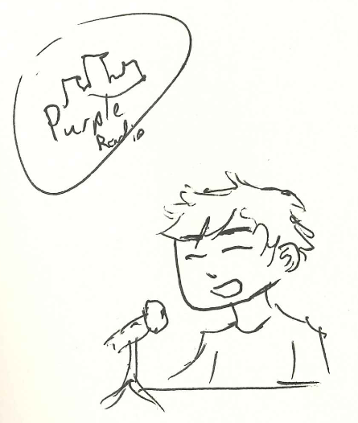
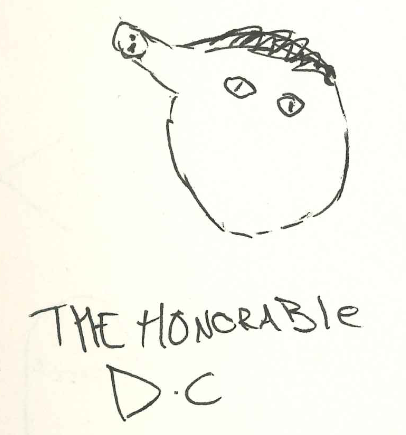
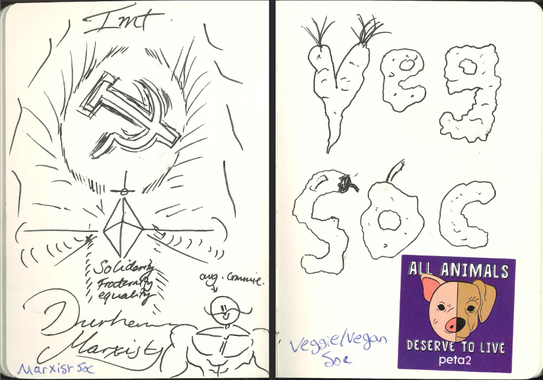
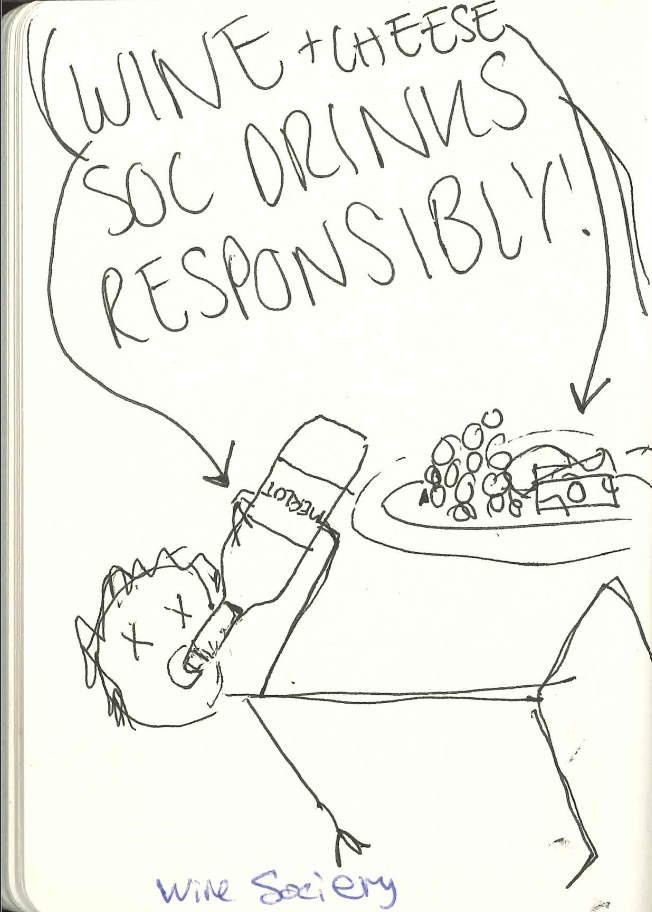
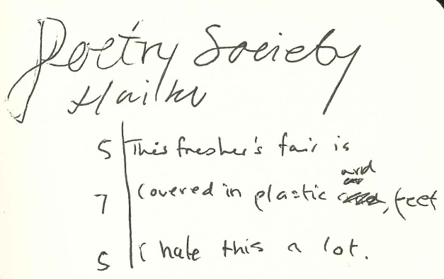

# Sketch Your Society: 100 different sketches from 100 different societies

<word-count parent=".markdown-body"></word-count>

In 2021, [Alex] and I wanted to go to freshers' fair at Durham to check out what cool, post-covid societies had sprung up. To make it entertaining, and force ourselves to talk to societies that we wouldn't otherwise, we wanted a creative idea. What we came up with was to take round a sketchbook to each society at the fair, and to propose to them "please draw something - *whatever you feel like* - in our sketchbook, to represent your society :)".

Many people who acquiesced our request asked us how they could see the whole book afterwards, or where it would be posted online. At the time we had no response, as we were just doing it for our own amusement. But now, thanks to the wonders of digitization, the answer is: right here!

(I recommend viewing this PDF with "[Even Spreads]", if you can, for the book-like experience)

[Even Spreads]: ./images/firefox-even-spreads.png
[Alex]: https://twitter.com/Somebody909

<a class="hover-area" href="./data/freshers-fair-book-cropped.pdf">
    

    

</a>

<figcaption>

[Freshers' Fair 2021 Sketchbook](./data/freshers-fair-book-cropped.pdf)

</figcaption>

## Inside the book

It's very fun to see such the wide range of ideas and creativity of people that results when you give them a pen. I also enjoyed that the societies ended up being almost paired up in the book, combining to create an artistic spread.

I implore you to 'flick' through the book above (it's clickable!), but I also highlight some of my favourite pages here. (or even ask me in person, and I might even just find the strange drawer or shelf where it has ended up.)

### Purple Radio

This was one of the first sketches and I just think it's neat.

### Archaeology Society

This one took by far the longest. Perhaps you can tell, because the result is beautiful. This also meant that Alex and I were forced to learn a hell of a lot about archaeology in those 15 minutes.

### "The Honorable D.C."

This is the only sketch which isn't labelled. To this day, I have no idea which society drew this one. Even knowing the section of the room it was in, neither Alex nor I could recall who drew it. Great sketch though.

### Marxist Society & Veg Soc

This is my favourite double-page spread in the book as both pages are richly full. Both societies filled the brief and made wonderful pages.

### Wine & Cheese Society

From talking to Wine & Cheese Society, it was all about having a laff. Their picture definitely respects that.

### Poetry Society

Finally, an entry after our own heart. After spending 6 hours ambling through the freshers' fair, sitting among rushed students and leaning around talking to whoever would listen to us, this haiku is very reflective.

## Conclusions

I hope you enjoyed a scroll through Durham University's social scene in 2021. If you didn't do so, slow down there! Have a look. Absorb some of the creativity within.
