# Snippets of a Degree - random sentences from random Masters' projects

<word-count parent=".markdown-body"></word-count>

I did a [Physics degree at Durham University](https://alifeee.co.uk/durham_physics/). This blog comes as a result of a party I had just before final year exams, after everyone had finished their final-year dissertations and reports.

To celebrate that we'd all spent half the year knee-deep inside a PDF, we had DICE (Dissertation Isdone Celebration Event)! As part of the party, I got people to write down a sentence or phrase from their dissertation, without context. We drew them out of a hat and made a game of guessing what the degree title was for each.

Recently I was reminded of the party when I pulled what remained of the notes from the bottom of a deep drawer. I thought that it would be nice to digitise them, so they're viewable, as I think that it's quite artistic that each note represents a sort of "summary" of someone's entire degree.

They were each numbered, but unfortunately, I didn't find the key which matched the number to the writer or degree title. But... that just means that *you* get to play the game of guessing what degree each belongs to!

<figcaption>

(p.s., after the [previous post](../sketch-your-society/), it seems as if I've turned this blog into [found paper](https://www.reddit.com/r/foundpaper). the next post won't be. maybe.)

</figcaption>

## The snippets

The labelling suggests there were at least 15 snippets, but number 10 is AWOL. Thus, here are only 14. To see the degree for each sentence, check the [answers](./answers.txt) (these will be updated as I remember them or as the people who wrote them read this...)

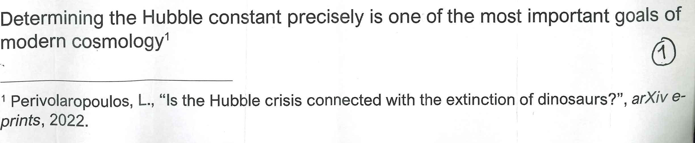

<figcaption>

Determining the Hubble constant precisely is one of the most important goals of modern cosmology¹

¹ Perivolaropoulos, L., "Is the Hubble crisis connected with the extinction of dinosaurs?", arXiv e-prints, 2022.

</figcaption>

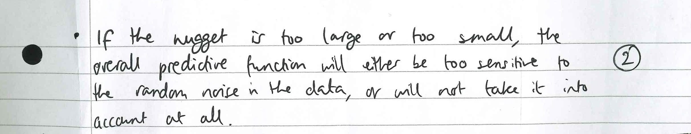

<figcaption>

If the nugget is too large or too small, the overall predictive function will either be too sensitive to the random noise in the data, or will not take it into account at all.

</figcaption>

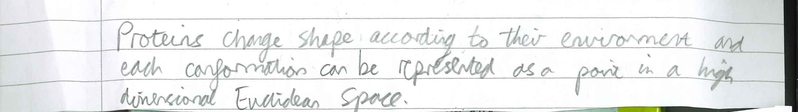

<figcaption>

Proteins change shape according to their environment and each conformation can be represented as a point in a high dimensional Euclidean Space.

</figcaption>

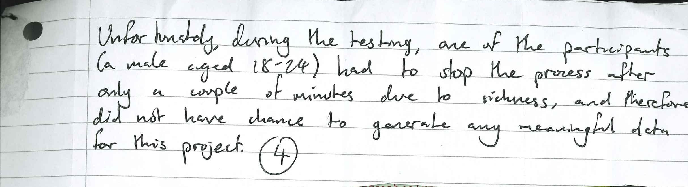

<figcaption>

Unfortunately, during the testing, one of the participants (a male aged 18-24) had to stop the process after only a couple of minutes due to sickness, and therefore did not have change to generate any meaningful data for this project.

</figcaption>

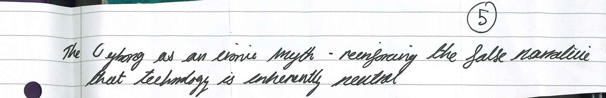

<figcaption>

The cyborg as an ironic myth - reinforcing the false narrative that technology is inherently neutral

</figcaption>

<figcaption>

However, it is not clear ***why*** the machine learner performs better...

</figcaption>

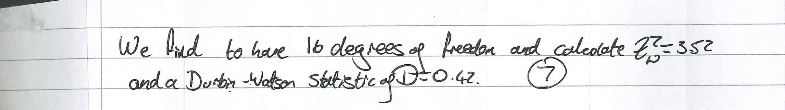

<figcaption>

We find to have 16 degrees of freedom and calculate `Z = 3.52` and a Durbin-Watson statistic of `D = 0.42`

</figcaption>

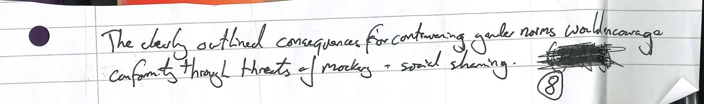

<figcaption>

The clearly outlined consequence for contravening gender norms would encourage conformity through threats of mockery + social shaming.

</figcaption>

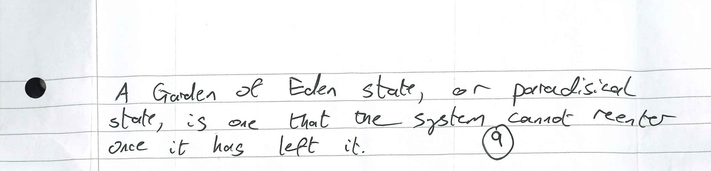

<figcaption>

A Garden of Eden state, or paradisical state, is one that the system cannot reenter once it has left it.

</figcaption>

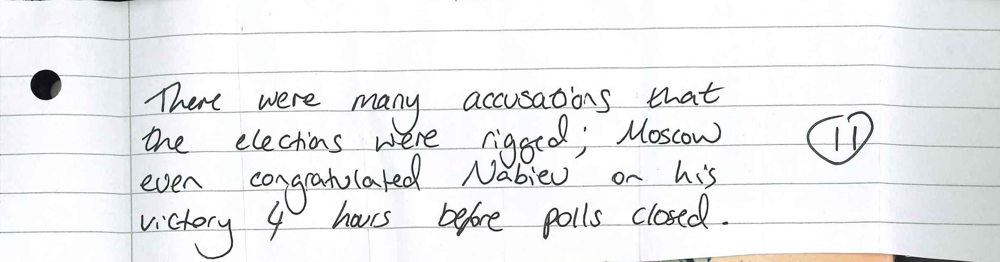

<figcaption>

There were many accusations that the elections were rigged; Moscow even congratulated Nabiev on his victory 4 hours before polls closed.

</figcaption>

<figcaption>

The "immune" state will be considered equivalent to the "dead" state for these purposes as anyone sick enough to die mid-transit wouldn't have made it this far.

</figcaption>

<figcaption>

"Justification & Motivation for PE"

PE = Printed Electronics

PE =/= Physical Education

</figcaption>

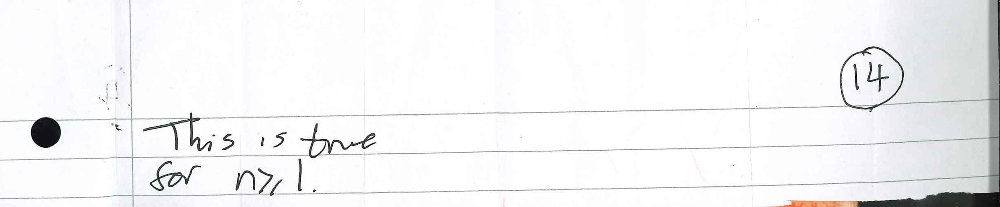

<figcaption>

This is true for `n ≥ 1`.

</figcaption>

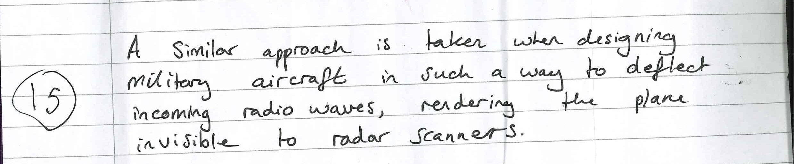

<figcaption>

A similar approach is taken when designing military aircraft in such a way to deflect incoming radio waves, rendering the plane invisible to radar scanners.

</figcaption>

Fun! How many did you guess?
